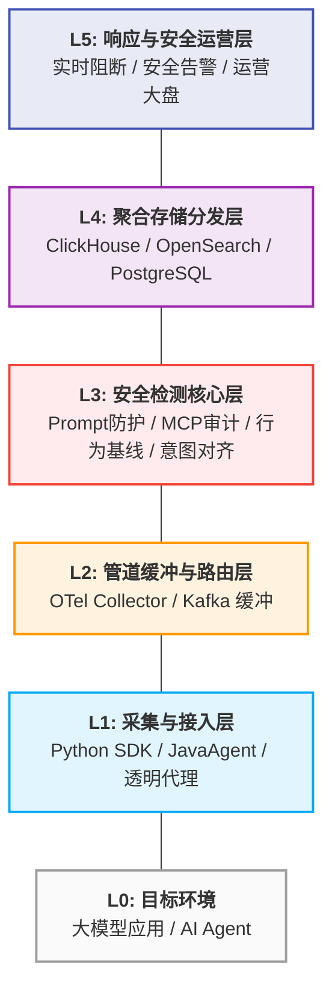

# AI Agent 运行时安全监控平台 (AgentSecurity Platform)

<p align="center">
  
  
  
</p>

## 📌 项目概述

**AI Agent 运行时安全监控平台** 是一套面向企业大模型应用的安全保障方案。通过 **SDK 插桩（Layer 1）**、**LLM API 透明代理（Layer 2）** 以及 **MCP 网关（Layer 3）** 的多层纵深防御体系，实现对 AI Agent 运行全生命周期的行为审计、内容合规、隐私脱敏及威胁阻断。

项目旨在解决大模型落地过程中的“黑盒运行”风险，为企业提供可观测、可审计、受保护的 AI Agent 运行环境。

---

## ✨ 核心特性

### 🛡️ 客户端 (Agent 端)
- **零侵入接入**：通过 Python 组件自动插桩及 JavaAgent 字节码注入，无需修改业务代码。
- **实时安全管线**：内置 PII 脱敏（Presidio）、凭证扫描（detect-secrets）、注入拦截探针（LLM Guard）。
- **本地合规日志**：关键安全事件本地持久化，支持合规审计。
- **全生态支持**：深度适配 OpenAI、Anthropic、LangChain、LlamaIndex、CrewAI 等主流框架。

### 📊 服务端 (管理平台)
- **多维度风险检测**：集成 NeMo Guardrails，支持 Prompt 注入、越狱、MCP 工具调用越界审计。
- **行为序列建模**：基于 OpenTelemetry 追踪 Agent 调用链，通过行为基线识别异常轨迹。
- **意图对齐审计**：利用“AI 判 AI”技术，动态评估 Agent 行动是否偏离原始用户意图。
- **大盘可视化**：实时监控 Agent 健康状态、Token 消耗、安全风险指标，支持 Trace 瀑布图。

---

## 🏗️ 系统架构

平台基于分层架构设计，从接入到响应形成完整闭环：



---

## 📂 项目结构

```text
.
├── client/                     # 客户端采集组件
├── agentsec-cli/           # Go 语言实现的管理 CLI
├── agentsec-python-sdk/    # Python SDK 插桩组件
├── server/                     # 服务端组件
├── RuoYi/                  # Spring Boot 后端 (管理 API & 规则引擎)
├── RuoYi-Vue3/             # Vue 3 前端 (管理后台界面)
├── third_party/                # 第三方引用或固定版本依赖
├── 设计文档/                   # 详细架构与 PRD 文档
└── AGENTS.md                   # 详细的开发说明书与贡献指南
```

---

## 🚀 快速开始

### 📋 环境准备
- **Java**: JDK 17+ (后端)
- **Node.js**: v16+ (前端)
- **Maven**: 3.6+ (构建后端)
- **Go**: 1.20+ (CLI 构建)
- **Python**: 3.9+ (SDK 测试)

### 1. 启动管理后端 (Java)
```bash
cd server/RuoYi
mvn clean install -DskipTests=true
# 启动应用
./bin/run.bat   # Windows
# 或 ./ry.sh start # Linux
```

### 2. 启动前端控制台 (Vue)
```bash
cd server/RuoYi-Vue3
npm install
npm run dev
```

### 3. 客户端接入 (Python 示例)
```bash
cd client/agentsec-python-sdk
python -m pip install -e .
# 在启动您的 Agent 时添加环境变量或导入 SDK (详见该目录下文档)
```

### 4. 客户端管理工具 (CLI)
```bash
cd client/agentsec-cli
make build
./agentsec-cli --help
```

---

## 🛠️ 开发与贡献

请在开始贡献前仔细阅读 **[AGENTS.md](./AGENTS.md)**。

### 代码风格
- **Java**: Allman Braces, 四空格缩进
- **Python**: PEP 8, Pydantic 模型
- **Go**: gofmt, Cobra 命令规范
- **Vue**: PascalCase 文件名, Element Plus 样式驱动

### 提交规范
提交信息需包含所属模块前缀，如：
- `client: add registration flag`
- `server: fix rule engine latency`
- `ui: update risk dashboard charts`

---

## 📄 开源协议
[MIT License](./server/RuoYi/LICENSE) (请根据实际情况确认)

---
© 2026 AI Agent 安全监测平台团队
