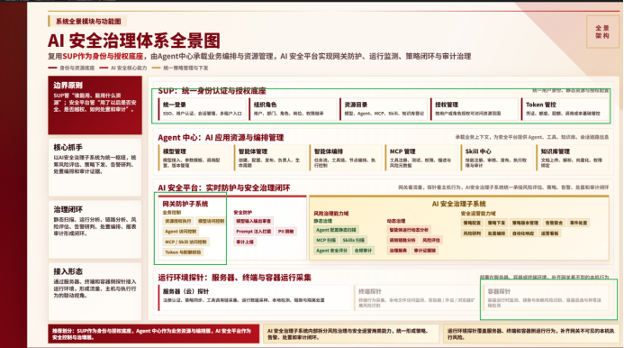

## 一、**分工方案：**

如下图绿色所示

1、统一身份认证与授权底座，建议平台部同事继续基于上轮的功能继续进行开发和完善。

2、网关防护子系统：建议业务控制部分也就是授权底座的实现继续由平台部实现，后续AI部门会在上面继续扩展安全防护模块，实现与AI安全治理子系统的基于网络侧的联动控制。

3、容器探针（技术预研）：此部分由于平台部对于容器的研究较为深入，可以研究基于容器方案的技术实现方案。

## **二、** **功能清单**

| **序号** | **功能名称**                    | **优先级** | **作用**                                                                                                                             |
| -------------- | ------------------------------------- | ---------------- | ------------------------------------------------------------------------------------------------------------------------------------------ |
| **1**    | **Token 认证与解析**            | P0               | 校验所有入站请求的Token（JWT/Session/OpenAPI Key），解析出合法的用户身份信息。非法 Token 在网关最前端就被拒绝（403），根本不流入下游业务。 |
| **2**    | **用户权限查询（Authz Check）** | P0               | 提供一个内部API，接收资源类型（model/agent/mcp/skill）和操作类型（read/execute），返回用户是否有权限以及完整的用户上下文。                 |
| **3**    | **HTTP Header 上下文注入**      | P0               | 在认证/鉴权通过后，将用户信息、组织信息、权限等级写入 HTTP Header（如 X-User-Id、X-Org-Id、X-Roles），透传给下游插件和业务。               |
| **4**    | **插件执行顺序保证**            | P0               | 确保SUP 业务控制插件的优先级**高于** AI 安全防护插件，使安全插件能获取到 SUP 已写入的 Header 信息。                                  |
| **5**    | **鉴权缓存与性能优化**          | P1               | 在网关层对权限查询结果做本地缓存或JWT 快速验签，确保鉴权延迟 < 50ms（P95）。                                                               |

## **功能详解**

### **Token 认证与解析**

 **作用** ：网关最前端对所有请求进行身份校验，确保只有合法用户才能进入下游流程。

 **关键产出** ：

· 解析出的用户ID、组织 ID、租户 ID

· 用户的基本角色或权限等级

· Token 的有效期和作用范围

 **后续使用** ：安全插件基于这些信息进行更细粒度的审计和防护策略。

### **用户权限查询（Authz Check）**

 **作用** ：为安全插件和智能体中心提供一个标准的权限决策接口，解决"离线请求、MCP 工具异步调用"等绕过网关的场景。

 **典型场景** ：

· 安全插件需要确认用户是否有权访问某个MCP Tool

· 智能体中心异步执行任务时需要二次权限核验

· AI 安全平台审计日志需要查询用户权限状态

### **HTTP Header 上下文注入**

 **作用** ：将认证后的用户信息以HTTP Header 的形式透传给下游，让安全插件无需重复校验身份，可直接基于这些信息做决策。

 **必须注入的Header** ：

· X-User-Id：用户唯一标识

· X-Org-Id：用户所属组织

· X-Tenant-Id：租户隔离标识

· X-Roles：用户角色列表（如admin, user, guest）

· X-Permission-Level：权限等级（如1-10 的数字标示）

· X-Resource-Type：当前请求访问的资源类型（model/agent/mcp/skill）

### **插件执行顺序保证**

 **作用** ：通过Higress 网关的插件顺序配置，确保 SUP 插件先执行、AI 安全插件后执行，这样安全插件就能读到 SUP 已写入的 Header。

 **实现** ：在Higress WasmPlugin 配置中设定 priority 字段，SUP 插件 priority > 安全插件 priority。

### **鉴权缓存与性能优化**

 **作用** ：降低单次鉴权的延迟，确保网关吞吐不会因为权限查询而下降。

 **典型做法** ：

· JWT 快速验签（无需调用外部服务）

· 权限查询结果的本地缓存（TTL 5-10 分钟）

· 权限变更时的实时同步推送或WebSocket 订阅

## 三、接口清单

| 序号        | 接口名称                   | 类型            | 优先级 | 说明                         |
| ----------- | -------------------------- | --------------- | ------ | ---------------------------- |
| **1** | **权限查询 API**     | REST            | P0     | 核心接口，用于权限决策       |
| **2** | **HTTP Header 注入** | Gateway Plugin  | P0     | 网关层自动写入，无需主动调用 |
| **3** | **Token 验证 API**   | Internal        | P0     | 可选，用于二次验证           |
| **4** | **权限变更推送**     | WebSocket/Event | P1     | 可选，用于实时同步           |
|             |                            |                 |        |                              |

---
