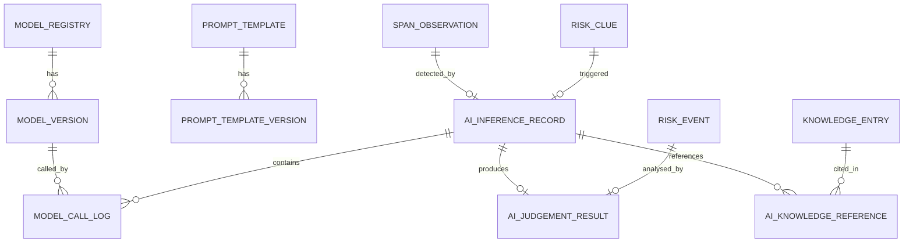
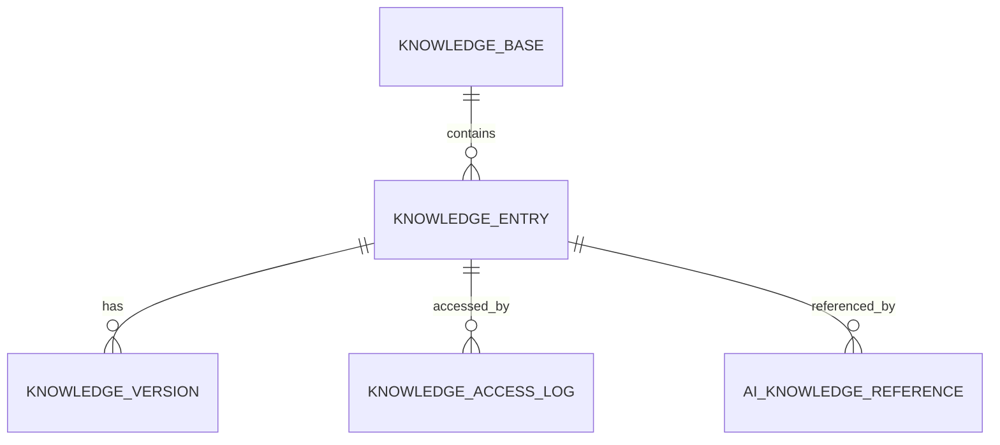
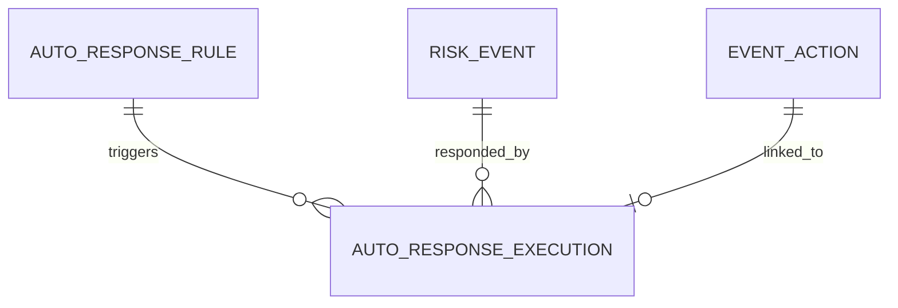

# 智能化改造概要设计 — 数据模型与服务接口

## 1. 数据模型扩展总览

### 1.1 新增实体清单

智能化改造共新增 **22** 个核心实体（含19个主实体+2个子表+1个安全审计表），按域分类如下：

> **注**：Agent服务两张表（`agent_definition`、`agent_execution_log`）归属07文档（智能体架构P4），未计入本清单。

| 域 | 新增实体 | 说明 | 期次 |
|---|---|---|---|
| **AI推理域** | `ai_inference_record` | AI推理结果（结构化，非JSON blob） | P0 |
| **AI推理域** | `ai_judgement_result` | AI研判结果（含不确定性表达、反馈字段） | P0.5a |
| **AI推理域** | `ai_knowledge_reference` | AI推理与知识条目的引用关联 | **P0.5a-min / P2a-full** |
| **模型治理域** | `model_registry` | 模型注册信息 | P0 |
| **模型治理域** | `model_version` | 模型版本信息 | P0 |
| **模型治理域** | `model_call_log` | 模型调用审计日志 | P0 |
| **模型治理域** | `prompt_template` | Prompt模板定义 | P0 |
| **模型治理域** | `prompt_template_version` | Prompt模板版本快照 | P0 |
| **知识库域** | `knowledge_base` | 知识库 | **P0.5a-min / P1-full** |
| **知识库域** | `knowledge_entry` | 知识条目（P0.5a仅manual来源） | **P0.5a-min / P1-full** |
| **知识库域** | `knowledge_version` | 知识条目版本 | **P0.5a-min / P1-full** |
| **知识库域** | `knowledge_access_log` | 知识访问审计 | **P1**（P0.5a用audit_log替代） |
| **样本域** | `sample_entry` | 样本条目（P0.5a仅candidate集） | **P0.5a-min / P1-full** |
| **SOC分析域** | `user_risk_profile` | 用户风险画像 | P2a |
| **SOC分析域** | `user_behavior_baseline` | 用户行为基线 | P2a |
| **SOC分析域** | `user_risk_accumulation` | 用户风险累积 | P2a |
| **SOC分析域** | `org_risk_profile` | 组织风险画像 | P2b |
| **自动响应域** | `auto_response_rule` | 自动响应规则 | P3 |
| **自动响应域** | `auto_response_execution` | 自动响应执行记录 | P3 |
| **AI推理域** | `ai_hit_fragment` | 命中片段子表（从JSON拆分） | P0 |
| **AI推理域** | `ai_similar_event` | 相似事件关联子表（从JSON拆分） | P0.5a |
| **模型治理域** | `sensitive_access_log` | 高敏数据访问审计（L2/L3） | P0 |
| **Agent服务** | `agent_definition`<br>`agent_execution_log` | 归属07文档（智能体架构P4） | P4 |

### 1.2 现有实体字段扩展

| 现有实体 | 新增字段 | 类型 | 说明 | 期次 |
|---|---|---|---|---|
| `span_observation` | `ai_detection_result_id` | FK | 关联AI检测结果实体 | P0 |
| `risk_clue` | `detection_source` | enum | rule / ai_model / rule_and_ai | P0 |
| `risk_clue` | `ai_status` | enum | AI检测状态（7值枚举） | P0 |
| `risk_event` | `ai_analysis_id` | FK | 关联AI研判结果实体 | P0.5a |
| `risk_event` | `ai_analysis_status` | enum | pending/generated/timeout/error/circuit_open/skipped/confirmed/modified/rejected | P0.5a |
| `event_action` | `ai_suggested` | bool | 是否来自AI建议 | P3 |
| `event_action` | `action_level` | enum | L1/L2/L3/L4 | P3 |
| `rule` | `ai_optimized` | bool | 是否经AI优化 | P1 |

---

## 2. 核心新增实体详细设计

### 2.1 AI推理域

#### 2.1.1 `ai_inference_record` — AI推理结果

```text
ai_inference_record:
  主键与关联:
  1. inference_id          — 推理记录唯一标识
  2. tenant_id             — 租户ID
  3. related_object_type   — 关联对象类型(span/risk_clue/event)
  4. related_object_id     — 关联对象ID

  推理输入:
  5. inference_type        — 推理类型(detection/judgement/remediation/report)
  6. detection_point       — 检测点(prompt_injection/jailbreak/sensitive/tool_boundary/multi_turn)
  7. model_version_id      — 模型版本ID
  8. prompt_template_version_id — Prompt模板版本ID
  9. input_evidence_refs   — 输入证据引用列表(JSON: [{span_id, field_path, offset}])
  10. input_data_level     — 输入数据级别(L0-L3)
  11. input_token_count    — 输入Token数

  推理输出（结构化）:
  12. risk_labels          — 风险标签列表(JSON: [string])
  13. confidence           — 置信度(0-1)
  14. attack_type          — 攻击类型(直接注入/间接注入/上下文注入/多轮累积/角色扮演/编码绕过/...)
  15. hit_fragments         — 命中片段列表（拆分为独立子表`ai_hit_fragment`，见§2.1.4）
  16. reasoning            — 判断理由
  17. counter_example       — 反例提示
  18. output_token_count   — 输出Token数

  状态与审计:
  19. inference_status     — 推理状态(success/timeout/error/circuit_open/skipped)
  20. latency_ms          — 推理耗时(毫秒)
  21. cost_estimate       — 成本估算(Token数×单价)
  22. degradation_applied — 是否触发了降级(bool)
  23. approval_id         — 审批单ID（L2/L3数据需审批时）
  24. created_at          — 创建时间
```

**实体边界说明：** `model_call_log`记录一次物理模型调用；`ai_inference_record`记录一次业务推理结果。一个推理可能包含多次模型调用（主模型+分类器、RAG检索、重试或降级），即1个inference_record对应N个model_call_log。

**JSON字段使用规范：**
- **可查询核心字段**：需要被检索、排序、聚合的字段，**禁止**用JSON存储，必须拆分为独立表或子表
- **扩展字段**：仅用于展示、不用于查询的字段，可用JSON存储，但必须明确定义Schema

本设计中以下字段从JSON拆分为独立表：
- `hit_fragments` → `ai_hit_fragment` 子表（可查询命中片段）
- `similar_events` → `ai_similar_event` 子表（可查询相似事件关联）

以下字段为扩展字段（JSON存储）：
- `input_evidence_refs` — 输入证据引用（仅展示，不查询）
- `missing_evidence` — 缺失证据列表（仅展示，不查询）
- `open_questions` — 开放问题（仅展示，不查询）

#### 2.1.2 `ai_judgement_result` — AI研判结果

```text
ai_judgement_result:
  主键与关联:
  1. judgement_id          — 研判结果唯一标识
  2. tenant_id             — 租户ID
  3. event_id              — 关联事件ID
  4. inference_id          — 关联AI推理记录ID

  研判输出:
  5. attack_technique      — 攻击手法分析
  6. impact_assessment      — 影响面评估
  7. similar_events        — 相似历史事件引用列表（拆分为独立子表`ai_similar_event`，见§2.1.5）
  8. priority_suggestion   — 处置优先级建议(low/medium/high/critical)
  9. reasoning             — 判断理由与依据引用
  10. confidence_level     — 置信等级(high/medium/low)，low必须人工复核
  10.1 confidence_score    — 置信度分数(0-1)，用于低置信阈值判定(<=0.6)
  11. missing_evidence     — 缺失证据列表(JSON: [string])
  12. open_questions       — 需人工补充的问题(JSON: [string])

  模型信息:
  13. model_version        — 模型版本号
  14. prompt_template_version — Prompt模板版本号
  15. generated_at         — 生成时间

  反馈字段:
  16. adoption_status      — 采纳状态(pending/confirmed/modified/rejected)
  17. modification_content — 修正内容
  18. modifier             — 修正人
  19. modification_time    — 修正时间
  20. knowledge_recalled   — 是否召回知识(bool) **[派生字段]**
  21. recalled_knowledge_ids — 召回的知识条目ID列表(JSON: [string]) **[派生字段]**
```

**知识引用字段说明：**

| 字段 | 类型 | 说明 | 事实源 |
|---|---|---|---|
| `knowledge_recalled` | bool | 是否召回知识 | 派生自 `ai_knowledge_reference` 是否存在记录 |
| `recalled_knowledge_ids` | JSON | 召回知识ID列表 | 派生自 `ai_knowledge_reference.knowledge_entry_id` 聚合 |
| `ai_knowledge_reference.recall_status` | enum | 知识召回状态 | **事实源**，由召回任务统一更新 |

**数据一致性规则：**
1. `ai_judgement_result.knowledge_recalled` = `EXISTS(SELECT 1 FROM ai_knowledge_reference WHERE inference_id = ?)`
2. `ai_judgement_result.recalled_knowledge_ids` = `SELECT knowledge_entry_id FROM ai_knowledge_reference WHERE inference_id = ?`
3. 当知识条目被召回时，由召回任务统一更新 `ai_knowledge_reference.recall_status` = 'recalled'
4. 禁止直接修改 `ai_judgement_result` 的知识引用字段，必须通过 `ai_knowledge_reference` 变更后同步派生

#### 2.1.3 `ai_knowledge_reference` — AI推理与知识引用关联

```text
ai_knowledge_reference:
  1. reference_id          — 引用唯一标识
  2. inference_id          — 关联AI推理记录ID（或judgement_id）
  3. knowledge_entry_id    — 知识条目ID
  4. knowledge_version     — 知识版本号
  5. relevance_score       — 相关性评分
  6. referenced_at         — 引用时间
  7. recall_status         — 召回状态(not_recalled/recalled)（P2a启用）
```

**字段期次差异：**

| 字段 | P0.5a-min | P2a-full | 说明 |
|---|---|---|---|
| `reference_id` | ✓ | ✓ | 引用唯一标识 |
| `inference_id` | ✓ | ✓ | 关联AI推理记录ID |
| `knowledge_entry_id` | ✓ | ✓ | 知识条目ID |
| `knowledge_version` | ✓ | ✓ | 知识版本号 |
| `relevance_score` | 固定值或null | ✓ | P0.5a关键词匹配可用固定值 |
| `referenced_at` | ✓ | ✓ | 引用时间 |
| `recall_status` | **null** | ✓ | P0.5a不支持知识召回追溯 |

**P0.5a约束说明：**
- P0.5a记录轻量引用关系，用于后续知识下架时的追溯
- `recall_status` 在P0.5a为null，不支持知识召回追溯（P2a才启用）
- 若业务方接受"P0.5a知识引用不支持召回追溯"，则P0.5a可不建此表，引用关系记在`ai_judgement_result.recalled_knowledge_ids` JSON中

#### 2.1.4 `ai_hit_fragment` — AI命中片段子表

**说明：** 从`ai_inference_record.hit_fragments`拆分出的独立子表，支持命中片段的检索和追溯。

```text
ai_hit_fragment:
  1. fragment_id           — 片段唯一标识
  2. inference_id          — 关联AI推理记录ID（FK）
  3. span_id               — 证据Span ID
  4. field_path            — 字段路径（如"prompt.content"）
  5. offset_start          — 偏移起始位置
  6. offset_end            — 偏移结束位置
  7. original_text_ref     — 命中片段原文引用（对象存储地址，非原文）
  8. fragment_hash         — 片段内容哈希（用于去重和校验）
  9. created_at            — 创建时间
```

**索引建议：** (inference_id), (span_id), (fragment_hash)

#### 2.1.5 `ai_similar_event` — AI相似事件关联子表

**说明：** 从`ai_judgement_result.similar_events`拆分出的独立子表，支持相似事件的查询和排序。

```text
ai_similar_event:
  1. similar_id            — 关联唯一标识
  2. judgement_id          — 关联AI研判结果ID（FK）
  3. similar_event_id      — 相似事件ID（被引用的历史事件）
  4. similarity_score      — 相似度评分(0-1)
  5. similarity_type       — 相似类型(keyword_match/vector_similar/combined)
  6. key_similarities      — 关键相似点描述（JSON: [string]）
  7. referenced_at          — 引用时间
```

**索引建议：** (judgement_id), (similar_event_id), (similarity_score)

### 2.2 模型治理域

#### 2.2.1 `model_registry` — 模型注册

```text
model_registry:
  1. model_id              — 模型唯一标识
  2. model_name            — 模型名称
  3. model_type            — 模型类型(classifier/llm/embedding)
  4. provider              — 提供商
  5. endpoint              — 调用地址
  6. auth_ref              — 鉴权信息引用
  7. max_data_level        — 允许的最高数据级别(L0-L3)
  8. deployment_mode       — 部署模式(private/cloud/local)
  9. status                — 模型状态(registered/testing/online/offline)
  10. description          — 描述
  11. created_at/updated_at
```

#### 2.2.2 `model_version` — 模型版本

```text
model_version:
  1. version_id            — 版本唯一标识
  2. model_id              — 关联模型ID
  3. version_number        — 版本号
  4. config                — 模型配置(JSON: temperature/max_tokens等)
  5. evaluation_result     — 评测结果摘要(JSON: {fpr, fnr, test_set_size})
  6. gate_status           — 上线门禁状态(pending/passed/failed)
  7. status                — 版本状态(draft/testing/canary/production)
  8. traffic_percent       — 流量百分比(0-100)
  9. publisher             — 发布人
  10. publish_time         — 发布时间
  11. created_at/updated_at
```

#### 2.2.3 `model_call_log` — 模型调用审计日志

```text
model_call_log:
  1. call_id               — 调用唯一标识
  2. tenant_id             — 租户ID
  3. inference_id          — 关联推理记录ID
  4. model_version_id      — 模型版本ID
  5. prompt_template_version_id — Prompt模板版本ID
  6. detection_point       — 检测点
  7. input_data_level      — 输入数据级别(L0-L3)
  8. input_token_count     — 输入Token数
  9. output_token_count    — 输出Token数
  10. latency_ms           — 耗时(毫秒)
  11. call_status          — 调用状态(success/timeout/error/rate_limited/circuit_open)
  12. error_code           — 错误码
  13. error_message        — 错误信息
  14. cost_estimate        — 成本估算
  15. degradation_triggered — 是否触发降级(bool)
  16. data_flow_target     — 数据流向目标(模型标识)

  数据安全审计字段:
  17. approval_id          — 审批单ID（L2/L3数据访问需审批时）
  18. desensitization_policy_version — 脱敏策略版本号
  19. desensitization_hit_count — 脱敏命中字段数
  20. output_data_level    — 输出数据级别(L0-L3)
  21. is_cross_border      — 是否跨境传输(bool)
  22. is_external_model    — 是否外部模型(bool，非私有化/本地)
  23. data_residency_region — 数据驻留区域(cn/hk/overseas)

  23. called_at            — 调用时间
```

#### 2.2.4 `sensitive_access_log` — 高敏数据访问审计日志

**说明：** 记录AI访问L2/L3级别Raw证据的审计日志，满足数据安全合规要求。

```text
sensitive_access_log:
  1. access_id             — 访问唯一标识
  2. tenant_id             — 租户ID
  3. accessor_id           — 访问人ID
  4. accessor_type         — 访问人类型(user/ai_model/agent)
  5. access_target_type    — 目标类型(span/raw_evidence/other)
  6. access_target_id      — 目标对象ID
  7. data_level            — 数据级别(L2/L3)
  8. approval_id           — 审批单ID（必须）
  9. approval_status       — 审批状态(pending/approved/rejected)
  10. access_reason        — 访问原因
  11. access_content_summary — 访问内容摘要（脱敏后）
  12. access_result        — 访问结果(success/denied)
  13. inference_id         — 关联AI推理记录ID（如为AI访问）
  14. accessed_at          — 访问时间
```

**索引建议：** (accessor_id), (approval_id), (accessed_at), (tenant_id)

#### 2.2.5 `prompt_template` / `prompt_template_version`

详见 02-三大底座设计 §1.2.2。

### 2.3 知识库域与样本域

详见 05-场景4-6 §2.10 数据模型。

### 2.4 SOC分析域

详见 05-场景4-6 §1.9 数据模型。

### 2.5 自动响应域

详见 04-场景2和3 §2.4 数据结构。

---

## 3. 逻辑ER图（新增部分）

### 3.1 AI推理域ER



### 3.2 知识库域ER



### 3.3 自动响应域ER



---

## 4. 服务拆分设计

### 4.1 现有服务域（9个）

| 服务 | 状态 | 改造说明 |
|---|---|---|
| `asset-service` | 现有不变 | — |
| `monitor-service` | 现有+改造 | 增加AI检测结果展示、会话风险追踪 |
| `event-service` | 现有+改造 | 增加AI研判卡片、反馈回流、自动响应执行记录 |
| `policy-service` | 现有+改造 | 增加AI检测配置、自动响应规则管理、AI优化建议 |
| `auth-service` | 现有不变 | — |
| `audit-service` | 现有+改造 | 增加模型调用审计、知识访问审计、数据流向审计 |
| `session-audit-service` | 现有不变 | — |
| `collector-config-service` | 现有不变 | — |
| `notify-service` | 现有不变 | — |

### 4.2 新增服务域（4个）

#### 4.2.1 `ai-model-service` — AI模型治理服务

| 能力 | 说明 | 期次 |
|---|---|---|
| 模型注册与版本管理 | 模型CRUD、版本注册、灰度切量 | P0 |
| Prompt模板管理 | 模板CRUD、版本管理、变量注入 | P0 |
| 模型网关 | 统一调用入口、路由、限流、熔断、降级 | P0 |
| 评分融合引擎 | 规则+AI评分融合，支持多种策略 | P0 |
| 调用审计 | model_call_log写入与查询 | P0 |
| 成本控制 | Token限额、月度预算、限流策略 | P0 |
| 评测机制 | 评测集管理、自动评测、门禁校验 | P1 |
| 脱敏框架 | 数据分级、脱敏规则配置、脱敏执行 | P0 |

#### 4.2.2 `knowledge-service` — 知识库服务

| 能力 | 说明 | 期次 |
|---|---|---|
| 知识库管理 | 知识条目CRUD、版本管理、入库审核 | P1 |
| RAG检索引擎 | 向量相似检索、关键词检索、安全扫描 | P1 |
| 可信度元数据 | 检索结果附加可信度元数据 | P1 |
| 知识安全防护 | 投毒检测、冲突检测、下架召回、影响面分析 | P1 |
| 样本库管理 | 样本采集标注、评估集管理、回放评估 | P1 |
| 安全问答 | 自然语言问答、知识缺口识别 | P1.5 |

#### 4.2.3 `analysis-service` — 高级SOC分析服务

| 能力 | 说明 | 期次 |
|---|---|---|
| 身份归一与实体解析 | 跨应用用户ID映射、组织映射 | P1 |
| 用户风险画像 | 风险聚合、趋势计算、排行 | P2a |
| 行为基线 | 基线计算、偏离检测、异常标记 | P2a |
| 风险累积 | 跨会话/跨应用/跨时间窗口累积 | P2a |
| 组织风险态势 | 业务线聚合、租户级聚合 | P2b |
| 关联与传播分析 | 跨应用传播、工具传播链 | P2a |
| 时序与趋势 | 趋势预测、周期识别 | P2b |

#### 4.2.4 `agent-service` — 智能体服务

| 能力 | 说明 | 期次 |
|---|---|---|
| 智能体定义与注册 | Agent定义、能力声明、权限配置 | P4 |
| 任务调度与执行 | 任务编排、步数限制、预算控制 | P4 |
| 运行控制面 | 审批点、人工确认、失败转人工 | P4 |
| 执行日志 | Agent执行步骤日志 | P4 |

### 4.3 服务调用关系

```text
monitor-service ──调用──→ ai-model-service（AI检测）
event-service ──调用──→ ai-model-service（AI研判）
event-service ──调用──→ knowledge-service（知识检索辅助研判）
policy-service ──调用──→ ai-model-service（AI规则优化建议）
analysis-service ──调用──→ ai-model-service（AI分析）
analysis-service ──调用──→ knowledge-service（知识检索）
agent-service ──调用──→ ai-model-service（模型调用）
agent-service ──调用──→ knowledge-service（知识检索）
agent-service ──调用──→ event-service（处置执行）
agent-service ──调用──→ policy-service（策略变更）

ai-model-service ──调用──→ 外部模型服务（通过模型网关）
knowledge-service ──调用──→ 向量数据库（RAG检索）
knowledge-service ──调用──→ ai-model-service（内容安全扫描）
```

---

## 5. 接口设计边界

### 5.1 新增接口命名（遵循现有资源化路径风格）

| 服务 | 接口路径 | 方法 | 说明 | 期次 |
|---|---|---|---|---|
| ai-model-service | `/model-registries` | CRUD | 模型注册管理 | P0 |
| ai-model-service | `/model-versions` | CRUD | 模型版本管理 | P0 |
| ai-model-service | `/model-call-logs` | GET | 模型调用日志查询 | P0 |
| ai-model-service | `/prompt-templates` | CRUD | Prompt模板管理 | P0 |
| ai-model-service | `/prompt-template-versions` | CRUD | Prompt模板版本管理 | P0 |
| ai-model-service | `/ai-inference-records` | GET/POST | AI推理结果查询与写入 | P0 |
| ai-model-service | `/ai-judgement-results` | GET/POST/PATCH | AI研判结果查询、写入、反馈 | P0.5a |
| ai-model-service | `/fusion-scores` | POST | 评分融合计算 | P0 |
| ai-model-service | `/model-gate-evaluations` | POST/GET | 评测执行与结果查询 | P1 |
| knowledge-service | `/knowledge-bases` | CRUD | 知识库管理 | P1 |
| knowledge-service | `/knowledge-entries` | CRUD | 知识条目管理 | P1 |
| knowledge-service | `/knowledge-versions` | CRUD | 知识版本管理 | P1 |
| knowledge-service | `/knowledge-access-logs` | GET | 知识访问日志 | P1 |
| knowledge-service | `/knowledge-search` | POST | 知识检索（RAG） | P1 |
| knowledge-service | `/sample-entries` | CRUD | 样本管理 | P1 |
| knowledge-service | `/sample-replay-evaluations` | POST | 回放评估 | P1 |
| analysis-service | `/user-risk-profiles` | GET | 用户风险画像 | P2a |
| analysis-service | `/user-behavior-baselines` | GET | 用户行为基线 | P2a |
| analysis-service | `/user-risk-accumulations` | GET | 用户风险累积 | P2a |
| analysis-service | `/org-risk-profiles` | GET | 组织风险画像 | P2b |
| analysis-service | `/risk-correlation-graphs` | GET | 风险关联图 | P2a |
| policy-service | `/auto-response-rules` | CRUD | 自动响应规则管理 | P3 |
| policy-service | `/auto-response-executions` | GET | 自动响应执行记录 | P3 |
| policy-service | `/emergency-stops` | POST | 紧急停止操作 | P3 |

### 5.2 接口分层（遵循现有四类划分）

| 接口类型 | 适用新增接口 | 说明 |
|---|---|---|
| 展示查询接口 | 所有GET接口 | 幂等、可缓存、可分页 |
| 业务操作接口 | AI研判反馈、样本标注、知识审核 | 必须鉴权、必须审计 |
| 平台控制接口 | 模型版本灰度、紧急停止、评测门禁 | 高风险、需二次确认或审批 |
| 审计与辅助接口 | model-call-logs、knowledge-access-logs | 审计查询 |

### 5.3 AI新增审批对象清单

| 审批对象类型 | 审批场景 | 审批人 | 期次 |
|---|---|---|---|
| `model_version_publish` | 模型版本上线（灰度→全量） | 技术负责人 | P0 |
| `prompt_template_publish` | Prompt模板版本发布 | 安全负责人 | P0 |
| `raw_evidence_access` | AI访问L2/L3级别Raw证据 | 安全管理员 | P0 |
| `auto_response_rule_enable` | 自动响应规则启用（L1-L3） | 业务负责人+安全负责人 | P3 |
| `auto_response_rule_l4` | L4级动作执行 | 安全负责人+MFA | P3 |
| `emergency_stop` | 全局急停操作 | 安全负责人 | P3 |
| `knowledge_entry_publish` | 知识条目上架 | 安全负责人 | P1 |
| `knowledge_entry_recall` | 知识条目下架 | 安全管理员 | P1 |
| `evaluation_set_freeze` | 评测集固定 | 质量负责人 | P1 |

---

## 6. P0.5a 最小实体与最小存储（裁剪版）

P0.5a 作为核心闭环最小可验收单元，不需要完整知识库和样本库，采用**裁剪版实体设计**：

### 6.1 P0.5a 最小知识库（简化版）

| 实体 | 裁剪内容 | 期次 |
|---|---|---|
| `knowledge_base` | 完整版 | P0.5a |
| `knowledge_entry` | **仅支持 manual 来源，无AI生成，无外部导入**<br>字段裁剪：无 embedding_vector_ref（存文本，不存向量）、无 RAG 安全扫描标记 | P0.5a |
| `knowledge_version` | 完整版 | P0.5a |
| `knowledge_access_log` | **延迟到 P1**。<br>P0.5a 复用现有 `audit_log` 记录知识访问（resource_type=knowledge_entry, action=access, operator=user_id） | P1 |
| RAG 检索 | **关键词检索必选，向量相似可选（可降级）**：无关键词混合，无安全扫描 | P0.5a |
| 向量存储 | **P0.5a 可选**：可用 pgvector 简化版，或甚至**仅用关键词匹配**（无向量） | P0.5a可选 |

**P0.5a 知识库约束：**
- 仅人工录入≥50条基础条目（攻击手法、处置预案）
- 相似事件关联：关键词匹配必选，向量匹配可选（可降级）
- 无知识条目AI生成、无RAG安全扫描、无可信度元数据（这些P1补齐）

### 6.2 P0.5a 最小样本库（裁剪版）

| 实体 | 裁剪内容 | 期次 |
|---|---|---|
| `sample_entry` | **仅 candidate 样本集，无 training/evaluation_fixed/regression/disputed**<br>字段保留：sample_id, **tenant_id**, sample_type, related_rule_id, related_event_id, content, annotation_status, **review_status**=pending_review, annotator, feedback_source, **created_at** | P0.5a |
| 评估集流转 | **P0.5a 不支持**，冻结机制P1引入 | P1 |
| 回放评估 | **P0.5a 不支持** | P1 |

**P0.5a 样本库约束：**
- 仅支持从反馈自动采集进入候选集
- 简单标注功能（sample_type, feedback_source）
- 无评测集、无训练集、无回归集、无争议集（这些P1补齐）

### 6.3 P0.5a 存储需求总结

| 存储 | P0.5a 最小版 | P1 完整版 | 差异 |
|---|---|---|---|
| 关系型业务库 | 19张表（不含knowledge_access_log, ai_similar_event可选） | 22张表 | 差3张表+若干字段 |
| 向量数据库 | **可选，可用简单方案替代** | 必须 | P0.5a可用关键词匹配 |
| 对象存储 | 不需要 | P1需要 | P0.5a知识纯文本 |

---

## 7. 存储架构扩展（完整版）

### 7.1 新增存储类型

| 存储类型 | 用途 | 技术选型建议 | 期次 |
|---|---|---|---|
| **向量数据库** | 知识条目嵌入向量存储与相似检索 | Milvus / Qdrant / pgvector | P1 |
| **AI推理结果库** | ai_inference_record / ai_judgement_result | 关系型业务库扩展 | P0 |
| **样本库** | sample_entry / 评估集 | 关系型业务库扩展 | P1 |

### 7.2 现有存储扩展

| 存储类型 | 扩展内容 | 期次 |
|---|---|---|
| 关系型业务库 | 新增22张表（模型治理6张+AI推理5张含2子表+知识库4张+样本1张+SOC分析4张+自动响应2张）<br>**注**：Agent两张表（agent_definition/agent_execution_log）归属07文档，P4独立建设 | P0-P4 |
| 检索索引库 | 新增AI推理结果索引、知识条目全文索引、样本检索索引 | P0-P1 |
| 缓存 | 模型路由缓存、Prompt模板缓存、知识检索结果缓存、熔断器状态缓存 | P0-P1 |
| 对象存储 | 知识条目附件、样本原始文件 | P1 |

### 7.3 数据驻留与合规

- 国内数据不出境，跨境需审批
- L2/L3数据加密存储
- 模型调用日志按租户隔离
- 向量数据库嵌入向量不含原文，原文存对象存储

---

## 8. 状态模型扩展

### 8.1 新增状态字段

| 状态字段 | 枚举值 | 适用实体 | 期次 |
|---|---|---|---|
| `ai_status` | not_configured/pending/success/timeout/error/circuit_open/skipped_by_policy | risk_clue, span_observation | P0 |
| `detection_source` | rule/ai_model/rule_and_ai | risk_clue | P0 |
| `ai_analysis_status` | pending/generated/timeout/error/circuit_open/skipped/confirmed/modified/rejected | risk_event | P0.5a |
| `adoption_status` | pending/confirmed/modified/rejected | ai_judgement_result | P0.5a |
| `inference_status` | success/timeout/error/circuit_open/skipped | ai_inference_record | P0 |
| `call_status` | success/timeout/error/rate_limited/circuit_open | model_call_log | P0 |
| `model_status` | registered/testing/online/offline | model_registry | P0 |
| `version_status` | draft/testing/canary/production | model_version | P0 |
| `gate_status` | pending/passed/failed | model_version | P1 |
| `knowledge_status` | draft/pending_review/active/suspended/recalled/archived | knowledge_entry | P1 |
| `sample_set` | candidate/training/evaluation_fixed/regression/disputed | sample_entry | P1 |
| `action_level` | L1/L2/L3/L4 | event_action, auto_response_rule | P3 |

所有状态变更必须写入现有`status_change_log`，关键操作还必须写入`audit_log`。

---

## 9. 核心接口详细契约

概要设计阶段定义接口边界，详细契约在后续详细设计文档中补充。本章节先定义核心接口的请求/响应结构、幂等键、错误码规范。

### 9.1 接口契约规范

**幂等性要求：**
- 所有写操作接口必须支持幂等，通过 `Idempotency-Key` 请求头实现
- 幂等键有效期：24小时
- 重复请求返回首次请求结果（HTTP 200 + 相同响应体）

**错误码规范：**
- `400` — 请求参数错误（详细错误信息在响应体）
- `401` — 未认证
- `403` — 无权限
- `404` — 资源不存在
- `409` — 资源冲突（如幂等键重复但请求体不同）
- `429` — 限流
- `500` — 服务端错误
- `503` — 服务降级（熔断器打开）

**审计要求：**
- 所有关键写操作接口必须记录审计日志（operator/resource_type/resource_id/action/result）

### 9.2 `/ai-judgement-results` 接口契约

#### POST /ai-judgement-results — 提交AI研判结果（内部服务调用）

**请求体：**
```json
{
  "event_id": "string",           // 关联事件ID（必填）
  "inference_id": "string",     // 关联推理记录ID（必填）
  "attack_technique": "string",   // 攻击手法分析
  "impact_assessment": "string",  // 影响面评估
  "similar_events": [             // 相似事件引用列表
    {"event_id": "string", "similarity_score": 0.85}
  ],
  "priority_suggestion": "high",  // enum: low/medium/high/critical
  "reasoning": "string",          // 判断理由
  "confidence_level": "high",     // enum: high/medium/low（low必须人工复核）
  "confidence_score": 0.92,       // 置信度分数(0-1)，用于低置信阈值判定(<=0.6)
  "missing_evidence": ["string"], // 缺失证据列表
  "open_questions": ["string"],   // 开放问题列表
  "model_version": "string",      // 模型版本号
  "prompt_template_version": "string",
  "knowledge_recalled": false,    // 是否召回知识
  "recalled_knowledge_ids": ["string"]
}
```

**响应体（201 Created）：**
```json
{
  "judgement_id": "string",       // 研判结果唯一标识
  "ai_analysis_status": "generated", // 状态：generated
  "created_at": "2024-01-15T10:30:00Z"
}
```

**错误码：**
- `400` — event_id/inference_id不存在，或confidence_score不在0-1范围
- `404` — 关联事件不存在
- `409` — 该事件已存在generated状态的研判结果

#### PATCH /ai-judgement-results/{judgement_id} — 人工反馈（确认/修正/拒绝）

**请求体：**
```json
{
  "adoption_status": "confirmed", // enum: confirmed/modified/rejected（必填）
  "modification_content": "string", // adoption_status=modified时必填
  "modifier": "user_id",          // 修正人ID（必填）
  "modification_reason": "string" // 修正原因（modified/rejected时建议填写）
}
```

**响应体（200 OK）：**
```json
{
  "judgement_id": "string",
  "adoption_status": "confirmed",
  "ai_analysis_status": "confirmed", // 同步更新为confirmed/modified/rejected
  "modified_at": "2024-01-15T11:00:00Z",
  "sample_recorded": true,        // 是否自动创建样本记录
  "sample_id": "string"           // 关联样本ID
}
```

**错误码：**
- `400` — adoption_status不在枚举范围，或modified时缺少modification_content
- `403` — 无研判反馈权限
- `404` — judgement_id不存在
- `409` — 该研判已处于confirmed/modified/rejected状态，不可重复操作

**幂等性：** 通过 `Idempotency-Key` 请求头实现。客户端生成UUID作为幂等键，服务端校验：
- 首次请求：执行操作，存储幂等键+请求体hash+响应
- 重复请求（相同幂等键）：
  - 若请求体hash相同：返回首次响应（HTTP 200）
  - 若请求体hash不同：返回 `409 Conflict`，提示"幂等键重复但请求内容不同"

**幂等键有效期：** 24小时

**注意：** 同一`judgement_id`可由同一人多次操作（如先"确认"后"修正"），每次需带不同`Idempotency-Key`

#### PATCH /risk-events/{event_id}/ai-analysis-status — 研判状态更新（内部服务调用）

**使用场景：** AI研判任务执行过程中，由 `analysis-service` 或 `ai-model-service` 在超时/错误/熔断/跳过时更新事件状态。

**请求体：**
```json
{
  "ai_analysis_status": "timeout", // enum: timeout/error/circuit_open/skipped（必填）
  "status_reason": "string",       // 状态原因描述（如：AI模型调用超时30s）
  "inference_id": "string",        // 关联推理记录ID（如存在）
  "model_version": "string",       // 调用的模型版本（如存在）
  "error_code": "string",          // 错误码（error状态时必填）
  "error_detail": "string"         // 错误详情（error状态时建议）
}
```

**状态写入规则：**

| 状态 | 触发条件 | 写入时机 | 后续处理 |
|---|---|---|---|
| `timeout` | AI研判超过30秒未返回 | 超时检测触发 | 事件状态变为`timeout`，提示人工复核 |
| `error` | AI模型调用异常/返回格式错误 | 捕获异常后 | 记录错误信息，提示人工复核 |
| `circuit_open` | 熔断器检测到连续失败 | 熔断触发时 | 事件状态变为`circuit_open`，该模型暂停 |
| `skipped` | 策略配置跳过AI研判（如敏感数据） | 研判开始前 | 记录跳过原因，不生成研判结果 |

**响应体（200 OK）：**
```json
{
  "event_id": "string",
  "ai_analysis_status": "timeout",
  "updated_at": "2024-01-15T10:35:00Z",
  "retry_eligible": false   // 是否允许重试（circuit_open/skipped为false）
}
```

**错误码：**
- `400` — ai_analysis_status不在枚举范围，或error状态缺少error_code
- `404` — event_id不存在
- `409` — 该事件已处于confirmed/modified/rejected状态，不可更新

**注意：** 此接口为**内部服务调用**，不暴露给前端，由AI执行引擎在服务间调用。

### 9.3 `/fusion-scores` 接口契约

#### POST /fusion-scores — 计算评分融合（内部服务调用）

**请求体：**
```json
{
  "rule_score": 75,               // 规则评分(0-100)
  "ai_score": 85,               // AI评分(0-100)，可能为null
  "ai_confidence": 0.88,          // AI置信度(0-1)，可能为null
  "ai_status": "success",         // AI检测状态
  "fusion_strategy": "rule_priority_ai_append" // enum: rule_priority_ai_append/max/weighted
}
```

**响应体（200 OK）：**
```json
{
  "composite_score": 85,          // 综合评分
  "rule_risk_score": 75,          // 规则评分
  "ai_risk_score": 85,           // AI评分（可能为null）
  "fusion_strategy": "rule_priority_ai_append",
  "score_upgraded_by_ai": true,   // AI是否导致等级上升
  "trigger_secondary_alert": true // 是否触发二次告警
}
```

**错误码：**
- `400` — 评分参数格式错误
- `500` — 融合计算错误

### 9.4 `/knowledge-search` 接口契约

#### POST /knowledge-search — RAG知识检索

**请求体：**
```json
{
  "query": "string",              // 检索查询（必填）
  "query_embedding": [0.1, 0.2],  // 查询向量（可选，服务端可自动生成）
  "search_type": "vector",        // enum: vector/keyword/hybrid（P0.5a默认keyword）
  "top_k": 3,                     // 返回结果数（默认3，最大10）
  "filters": {                    // 过滤条件（P0.5a可仅支持kb_types）
    "kb_types": ["attack_technique", "remediation"],
    "trust_levels": ["verified"],  // P0.5a可为null（无可信度元数据）
    "valid_only": true            // 只返回未过期的（P0.5a可选）
  },
  "include_metadata": true        // 是否包含可信度元数据（P0.5a强制false）
}
```

**P0.5a 裁剪模式说明：**
- `search_type`：P0.5a默认`keyword`，向量检索为可选增强
- `filters.trust_levels`：P0.5a无此字段，知识条目无可信度元数据
- `filters.valid_only`：P0.5a可选，知识条目无有效期限制
- `include_metadata`：P0.5a强制为`false`，无可信度元数据返回

**响应体（200 OK）：**
```json
{
  "results": [
    {
      "entry_id": "string",
      "title": "string",
      "content": "string",          // 知识内容
      "relevance_score": 0.92,      // 相关性评分（P0.5a关键词匹配可用固定值）
      "source_type": "manual",      // enum: manual/ai_generated/external（P0.5a仅manual）
      "trust_level": "verified",    // P0.5a为null（无可信度元数据）
      "valid_until": "2025-01-01", // P0.5a为null（无有效期）
      "can_use_in_context": true,  // P0.5a强制true（仅人工录入内容可用）
      "reference_count": 42         // P0.5a为null（无引用统计）
    }
  ],
  "total_found": 15,
  "search_time_ms": 120
}
```

**字段期次标注：**
| 字段 | P0.5a | P1完整版 | 说明 |
|---|---|---|---|
| `source_type` | 仅`manual` | 全枚举 | P0.5a无AI生成/外部导入 |
| `trust_level` | `null` | 有值 | P0.5a无可信度元数据 |
| `valid_until` | `null` | 有值 | P0.5a无有效期管理 |
| `can_use_in_context` | 强制`true` | 按实际 | P0.5a仅人工录入，默认可用 |
| `reference_count` | `null` | 有值 | P0.5a无引用统计 |

**错误码：**
- `400` — query为空或过长（>1024字符）
- `503` — 向量数据库不可用（可降级为关键词检索）

### 9.5 `/emergency-stops` 接口契约

#### POST /emergency-stops — 全局急停

**请求体：**
```json
{
  "stop_type": "global",          // enum: global/tenant/rule（必填）
  "target_id": "string",          // tenant_id/rule_id（非global时必填）
  "operator": "user_id",          // 操作人（必填）
  "reason": "string",             // 急停原因（必填）
  "recover_immediately": false,   // 是否立即恢复可逆动作
  "recover_types": ["L2", "L3"]   // 立即恢复的动作级别
}
```

**响应体（202 Accepted）：**
```json
{
  "stop_id": "string",            // 急停操作唯一标识
  "stop_status": "executing",     // enum: executing/completed/failed
  "affected_rules_count": 15,     // 影响的规则数
  "affected_executions_count": 42, // 正在执行的自动响应数
  "recovered_count": 20,          // 立即恢复的动作数
  "estimated_completion": "2024-01-15T10:35:00Z"
}
```

**异步回调：** 急停完成后调用 webhook 或发送消息队列通知

**错误码：**
- `400` — stop_type不在枚举范围，或缺少target_id
- `403` — 无急停权限（需安全管理员角色）
- `409` — 已有进行中的急停操作

**幂等性：** 通过 `Idempotency-Key` 请求头实现。

**冲突检测逻辑（服务端实现）：**
```
1. 检查是否有active_stop正在执行（stop_status=executing）
2. 若有active_stop且stop_scope相同 → 返回 `409 Conflict`，提示"已有进行中的急停操作"
3. 若无active_stop或stop_scope不同 → 接受新请求
```

**注意：** 同一操作人在短时间内对同一租户/规则发起多次急停，若前一次已完成（stop_status=completed），则允许再次发起（需带不同`Idempotency-Key`）

---
