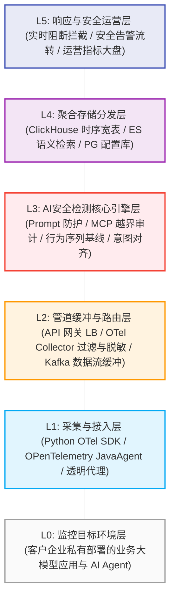
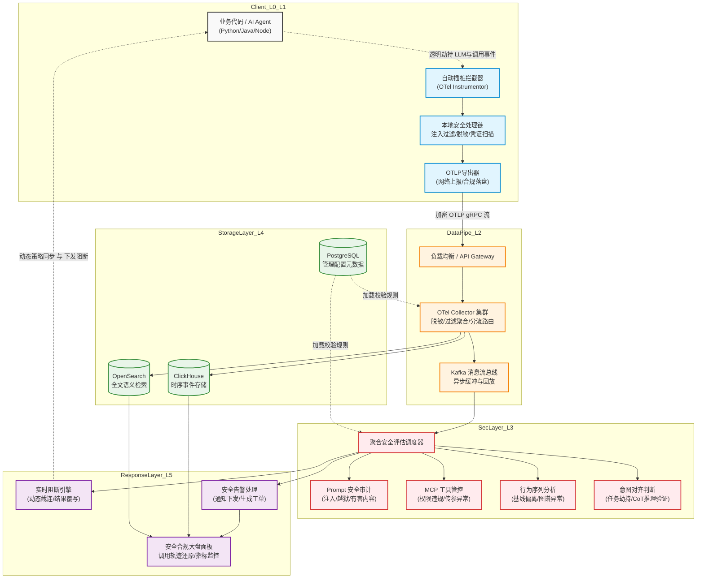

**AI Agent 运行时安全监控平台**

**架构设计与开发功能规划文档**

— 基于层1 SDK插桩的完整业务闭环方案 —

|          |                            |
|:---------|:---------------------------|
| **版本** | v1.0.0                     |
| **日期** | 2026-03                    |
| **状态** | 草稿 / 评审中              |
| **定位** | 层1 SDK插桩 → 完整业务闭环 |

**1. 文档概述与产品定位**

本文档描述以 SDK 插桩（层1）为核心接入方式，配合 LLM API 透明代理（层2）、MCP 网关（层3），构建一套面向 AI Agent 运行时安全监控的完整平台。文档涵盖开源组件选型、系统架构、数据流设计及全模块开发功能清单。

> **产品核心价值主张**
> 
> 1. 通用性：支持 Python / Java / Node.js 等主流语言，以及容器化、沙箱等部署形态
> 
> 2. 低侵入：Python 改一行命令、Java 加 javaagent 参数，业务代码零改动
> 
> 3. 完整闭环：从数据采集 → 实时检测 → 存储分析 → 告警阻断全链路贯通
> 
> 4. 差异化：MCP 工具调用审计 + 行为意图对齐检测，填补现有开源空白

**2. 开源组件选型**

**2.1 采集层组件**

下表列出层1 SDK 插桩所依赖的核心开源组件，按语言和功能分类：

| **组件名称** | **语言/平台** | **功能定位** | **引入方式** | **GitHub** |
|:---|:---|:---|:---|:---|
| opentelemetry-python-contrib | Python | 自动插桩 openai/anthropic/LangChain/LlamaIndex 等主流框架 | pip install | open-telemetry/opentelemetry-python-contrib |
| openllmetry (traceloop) | Python / JS | 专为 LLM/Agent 场景设计的 OTel 语义扩展，覆盖 prompt/response/token 完整采集 | pip install traceloop-sdk | traceloop/openllmetry |
| opentelemetry-instrumentation-openai-v2 | Python | 捕获 OpenAI SDK 的完整 messages/model/temperature 并写入 span attributes | pip install | open-telemetry/opentelemetry-python-contrib |
| opentelemetry-javaagent.jar | Java / JVM | 字节码插桩，覆盖 HTTP Client / JDBC / Kafka / gRPC / Spring Web 等 100+ 框架 | javaagent 启动参数 | open-telemetry/opentelemetry-java-instrumentation |
| opentelemetry-sdk (Go) | Go | 代理服务自身的 trace 上报 | go mod | open-telemetry/opentelemetry-go |

**2.1.1 Python SDK 开发选型与依赖**

| 技术领域 | 选型 | 版本 | 选型理由 |
| :--- | :--- | :--- | :--- |
| **插桩核心** | `openllmetry (traceloop-sdk)` | >= 0.22 | 专为 LLM 场景设计，原生深度支持 OpenAI (捕获 messages/model/token 等)、LangChain、LlamaIndex 等框架 |
| **OTel 基础** | `opentelemetry-python-contrib` | >= 1.20 | 覆盖底层网络库 (requests / httpx / aiohttp) 及标准 OTel 采集 |
| **数据导出** | `opentelemetry-exporter-otlp-proto-grpc` | >= 1.20 | gRPC 传输，性能更优，支持流式背压 |
| **本地 PII 脱敏** | `presidio-analyzer` + `presidio-anonymizer` | >= 2.x | Microsoft 出品，支持自定义识别器，在 span 上报前本地脱敏 |
| **配置管理** | `pydantic-settings` | >= 2.x | 类型安全的环境变量 / 配置文件加载 |
| **HTTP 客户端** | `httpx` | >= 0.25 | 同步/异步双支持，比 requests 更现代 |
| **JWT 处理** | `python-jose[cryptography]` | >= 3.x | 轻量级 JWT 解析与验证 |
| **打包分发** | `hatch` + `PyPI 私有源` | latest | 现代 Python 构建工具，支持语义化版本 |
| **凭证扫描** | `detect-secrets` | >= 1.4 | 本地扫描 Prompt 中的硬编码密钥、内部凭证 |
| **注入防御** | `LLM Guard` | latest | 轻量级 Prompt 注入与越狱拦截探针 |
| **日志留存** | `OTel File Exporter` | - | 将端侧产生的关键安全事件本地落盘留档 |


**2.1.2 Java SDK 开发选型与依赖**

| 技术领域 | 选型 | 版本 | 选型理由 |
| :--- | :--- | :--- | :--- |
| **插桩核心** | `opentelemetry-javaagent.jar` | >= 2.0 | 字节码插桩，真零代码改动，100+ 框架自动覆盖 |
| **Extension 扩展** | `opentelemetry-sdk-extension-autoconfigure` | >= 2.0 | 自定义 Instrumentation Extension 扩展点 |
| **LLM 捕获** | 自研 `OkHttp/HttpClient Instrumentation Extension` | - | 捕获 LLM HTTP body 中 prompt 内容（OTel JavaAgent 原生不解析 body） |
| **数据导出** | `opentelemetry-exporter-otlp-grpc` | >= 2.0 | 与 Python SDK 保持协议一致 |
| **本地脱敏** | 自研 `SecuritySpanProcessor` + 正则规则 | - | 轻量级，不引入重型依赖 |
| **打包分发** | `Gradle` + `Maven 私有仓库` | - | 企业 Java 生态标准 |

**2.2 数据管道组件**

| **组件名称** | **功能定位** | **核心能力** | **GitHub / 官网** |
|:---|:---|:---|:---|
| OpenTelemetry Collector | 统一数据枢纽 | Receiver 接收多源数据；Processor 实时过滤/PII脱敏/安全规则；Exporter 输出多目标 | open-telemetry/opentelemetry-collector-contrib |
| LiteLLM Proxy | LLM API 透明代理（层2） | 拦截所有 LLM 调用，内置 logging / guardrails 集成，支持 50+ 模型 | BerriAI/litellm |
| Apache Kafka | 异步事件流总线 | 解耦采集与检测，支持高吞吐 span 事件缓冲与回放 | apache/kafka |

**2.3 安全检测组件**

| **组件名称** | **检测方向** | **核心能力** | **GitHub** |
|:---|:---|:---|:---|
| NeMo Guardrails | Prompt 注入 / 越狱 | 可编程 guardrails，支持 input/dialog/output rails，LangChain 集成 | NVIDIA/NeMo-Guardrails |
| LlamaFirewall (Meta) | 意图对齐 / 代码安全 | AlignmentCheck (少样本 CoT 审计)；CodeShield (LLM 生成代码静态分析) | meta-llama/PurpleLlama |
| LLM Guard | PII / 毒性 / 相关性 | 开源输入输出扫描器，可集成进 OTel Span Processor | laiyer-ai/llm-guard |
| Microsoft Presidio | PII 识别与 脱敏 | 业界标杆 PII 识别引擎，支持本地化部署与多语言 | microsoft/presidio |
| detect-secrets | 凭证扫描 | 轻量级密钥与凭证扫描工具，防止敏感信息外传 | Yelp/detect-secrets |

**2.4 存储与可观测性组件**

| **组件名称** | **定位** | **选型理由** | **GitHub / 官网** |
|:---|:---|:---|:---|
| ClickHouse | 时序事件存储（主库） | 列式存储，时序聚合查询极快，适合海量 span 事件分析 | ClickHouse/ClickHouse |
| OpenSearch | 全文检索 / 告警 | prompt 内容全文搜索、Kibana 风格看板、告警规则引擎 | opensearch-project/OpenSearch |
| Langfuse | LLM Trace 可视化 | 开源 LLM 可观测性平台，原生支持 OTel，直观展示 Agent 调用链 | langfuse/langfuse |
| Grafana | 监控看板 | 统一指标/日志/trace 看板，对接 ClickHouse 和 OpenSearch | grafana/grafana |
| PostgreSQL | 业务元数据存储 | 存储策略规则、Agent 注册信息、告警配置等结构化数据 | postgres/postgres |
| Redis | 实时缓存 / 限流 | 会话状态缓存、实时限流计数器、规则热更新 | redis/redis |

**3. 系统架构设计**

**3.1 整体架构分层**

平台分为六个核心层次，自上而下分别承担数据采集、传输、检测、存储、响应和管理职责：

| **层次** | **名称** | **核心职责** | **主要组件** |
|:---|:---|:---|:---|
| L0 | Agent 侧（客户环境） | 运行中的 AI Agent，被监控对象 | Python/Java/容器 Agent |
| L1 | 插桩采集层 | SDK 自动捕获 LLM 调用、工具调用的完整语义数据 | openllmetry / OTel JavaAgent / LiteLLM Proxy |
| L2 | 数据管道层 | 统一接收、过滤、脱敏、路由 span 事件流 | OTel Collector / Kafka |
| L3 | 安全检测层 | 实时规则匹配、Prompt 注入检测、行为序列分析、意图对齐评分 | NeMo / LlamaFirewall / 自研检测引擎 |
| L4 | 存储分析层 | 持久化 span 事件，支撑时序查询、全文检索、行为建模 | ClickHouse / OpenSearch / PostgreSQL |
| L5 | 响应执行层 | 实时阻断、告警通知、规则下发、安全运营看板 | Vigil SOC / Grafana / 自研控制台 |

> **物理架构分层关系图：** 抽象展示系统从目标底层环境到上层安全运营与响应的自下而上分层体系结构。



> **核心架构流转图：** 以 SDK 端插桩为主的完整数据采集、处理和响应闭环，串联平台的 L0-L5 多个层级，清晰展示端云协同架构。



**3.2 SDK 插桩接入方式**

根据客户 Agent 的开发语言，提供两种零侵入接入路径：

**3.2.1 Python Agent 接入**

```bash
Python 接入方式（修改启动命令，业务代码零改动）
# 1. 安装依赖
pip install traceloop-sdk opentelemetry-instrumentation-openai-v2
# 2. 修改启动命令（在原命令前添加 opentelemetry-instrument 前缀）
OTEL_SERVICE_NAME=customer-agent
OTEL_EXPORTER_OTLP_ENDPOINT=https://your-collector:4317
OTEL_EXPORTER_OTLP_HEADERS="Authorization=Bearer ${TOKEN}"
opentelemetry-instrument python agent_main.py
# 自动插桩覆盖：openai SDK、anthropic SDK、requests/httpx/aiohttp、LangChain、LlamaIndex、CrewAI
```

**3.2.2 Java Agent 接入**

```bash
Java 接入方式（修改 JVM 启动参数，字节码插桩，真零代码改动）
# 下载 OTel Java Agent（约 30MB）
wget https://github.com/open-telemetry/opentelemetry-java -instrumentation/releases/latest/download/opentelemetry-javaagent.jar
# 修改启动命令（仅加 javaagent 参数）
java -javaagent:/opt/otel/opentelemetry-javaagent.jar
-Dotel.service.name=customer-agent
-Dotel.exporter.otlp.endpoint=https://your-collector:4317
-Dotel.exporter.otlp.headers="Authorization=Bearer ${TOKEN}"
-jar customer-agent-app.jar
# 自动覆盖：OkHttp / Apache HttpClient / Feign / JDBC / Kafka / gRPC / Spring Web 等 100+ 框架
```

**3.3 数据流设计**

所有采集到的数据统一转换为 OTEL span 格式，通过 agent_session_id 串联同一次 Agent 运行的所有事件，后端存储层不感知数据来源层次。

| **数据类型** | **关键字段** | **来源层** | **用途** |
|:---|:---|:---|:---|
| LLM 调用事件 | session_id / model / prompt / response / token_count / latency / source_ip / intent_alignment_score | 层1 SDK / 层2 代理 | Prompt 注入检测 / Token 异常监控 / 成本分析 |

**3.4 客户端 SDK 内部代码架构**

**3.4.1 Python SDK 架构**

Python SDK 采用分层架构：
**Instrumentors（框架捕获层）→ Processors（本地处理层）→ Exporters（传输层）**

辅助模块：Auth（认证） / Config（配置） / Heartbeat（心跳）

**项目结构示例**
```text
aiwatch-sdk-python/                          # SDK 根目录
├── src/
│   └── aiwatch_sdk/                         # 核心包
│       ├── __init__.py                      # 公开 API 入口 (initialize, shutdown)
│       ├── core/                            # 核心基础层
│       │   ├── tracer.py                    # OTel TracerProvider 统一封装
│       │   ├── session.py                   # Agent Session ID 生命周期管理
│       │   ├── config.py                    # SDK 配置模型 (pydantic-settings)
│       │   └── lifecycle.py                 # SDK 初始化 / 优雅关闭编排器
│       ├── instrumentors/                   # 框架插桩层
│       │   ├── base.py                      # BaseInstrumentor 抽象基类
│       │   ├── openai_instrumentor.py       # OpenAI SDK 插桩
│       │   ├── langchain_instrumentor.py    # LangChain 插桩
│       │   └── mcp_instrumentor.py          # MCP 工具调用插桩
│       ├── processors/                      # Span 本地处理层
│       │   ├── injection_guard.py           # Prompt 注入拦截 Processor
│       │   ├── pii_masker.py                # PII 脱敏 Processor
│       │   ├── secret_scanner.py            # 凭证与密钥扫描 Processor
│       │   ├── security_tagger.py           # 安全标签与元数据增强 Processor
│       │   ├── rate_limiter.py              # 流量与 Token 配额熔断 Processor
│       │   └── sampler.py                   # 本地采样策略
│       ├── exporters/                       # 数据传输层
│       │   ├── otlp_exporter.py             # OTLP gRPC 导出
│       │   ├── file_exporter.py             # 本地合规日志落盘导出
│       │   └── retry_buffer.py              # 离线缓冲
│       ├── auth/                            # 认证与注册层
│       │   ├── registry.py                  # Agent 注册 (M1-02)
│       │   └── token_manager.py             # JWT Token 自动刷新
│       └── heartbeat/                       # 心跳与健康检查层
│           └── reporter.py                  # 心跳上报
└── tests/                                   # 测试目录
```

**核心数据流**
1.  **用户代码**：Agent 运行。
2.  **Instrumentors**：通过 OTel 自动插桩拦截。
3.  **Processors Pipeline (安全处理管线)**：
    - 检查站 1 (注入防护)：`injection_guard.py` 评估 Prompt 注入高危则截断。
    - 检查站 2 (数据防泄漏)：`pii_masker.py` 和 `secret_scanner.py` 清洗隐私数据和凭证。
    - 检查站 3 (资源管控)：`rate_limiter.py` 限制单位时间内频率与Token花费。
    - 检查站 4 (元数据增强)：`security_tagger.py` / `enricher.py` 注入 session_id / agent_id 等合规元数据。
    - 采样：`sampler.py` 应用采样策略。
4.  **Exporters**：通过 OTLP 发送至平台 Collector，并支持 `file_exporter.py` 本地化落盘。

**3.4.2 Java SDK 架构**
Java SDK 以 `opentelemetry-javaagent.jar` 为基础，通过自研 Extension 增强安全监控能力。

```text
aiwatch-sdk-java/                            # Java SDK 根目录
├── aiwatch-agent-extension/                 # OTel JavaAgent Extension 模块
├── aiwatch-instrumentation-llm/             # LLM HTTP 请求体捕获模块
├── aiwatch-processors/                      # Span 处理器模块 (脱敏/标签)
├── aiwatch-auth/                            # 认证与注册模块
└── aiwatch-heartbeat/                       # 心跳模块
```


**4. 开发功能清单**

按照业务闭环的完整路径，将所有开发功能划分为 7 个模块。优先级定义：P0 = MVP 必须（业务闭环最小集）；P1 = 重要功能（差异化竞争力）；P2 = 扩展功能（完整产品）。

| **模块编号** | **模块名称** | **核心职责** | **优先级** |
|:---|:---|:---|:---|
| M1 | SDK 采集与接入管理 | 管理 SDK 分发、接入配置、Agent 注册与健康状态 | P0 |
| M2 | OTel Collector 数据管道 | 数据统一接收、Processor 安全规则、PII脱敏、多路由输出 | P0 |
| M3 | 安全检测引擎 | Prompt 注入、工具调用审计、行为序列分析、意图对齐评分 | P0 / P1 |
| M4 | 存储与查询服务 | 事件持久化、时序查询 API、全文检索、数据生命周期管理 | P0 |
| M5 | 告警与响应系统 | 实时阻断、告警规则引擎、通知渠道、事件工单管理 | P1 |
| M6 | 安全运营控制台 | Agent 监控看板、调用链可视化、风险报告、规则管理 | P1 |
| M7 | 平台基础设施 | 多租户、认证授权、API 网关、SDK 版本管理、审计日志 | P0 / P1 |

**4.1 M1 — SDK 采集与接入管理**

负责整个平台的第一个接触点：将监控能力交付到客户 Agent，并管理接入全生命周期。

> **[M1-01] SDK 包装与分发** 优先级: **P0**
> 
> 基于 openllmetry 封装平台专属 SDK，屏蔽底层 OTel 复杂性，提供一行初始化接入
> 
> ✦ Python SDK：封装 traceloop-sdk + 自动注册平台 Collector endpoint
> 
> ✦ Java SDK：自定义 OTel Instrumentation Extension，捕获 LLM HTTP body 中的 prompt 内容
> 
> ✦ SDK 版本管理：语义化版本 + ChangeLog，支持灰度发布
> 
> ✦ SDK 分发渠道：PyPI 私有源 / Maven 私有仓库 / CDN 直接下载

> **[M1-02] Agent 注册与配置管理** 优先级: **P0**
> 
> 客户侧 Agent 启动时向平台注册身份，平台下发个性化监控配置
> 
> ✦ Agent 注册 API：接收 agent_name / language / framework / version 等元信息
> 
> ✦ 动态 Token 签发：JWT 短期 Token，用于 Collector 认证与数据上报
> 
> ✦ 配置下发：下发采样率、PII 脱敏正则、危险关键词、Token 预算配额等
> 
> ✦ 本地合规日志：满足《个保法》审计要求，支持拦截事件本地 JSON 滚动存储

> **[M1-03] SDK 健康检查与心跳** 优先级: **P1**
> 
> 确保采集链路持续稳定工作
> 
> ✦ 心跳上报：SDK 每 30s 上报存活状态及采集指标（span 数量、丢失数、延迟）
> 
> ✦ 接入断连告警：心跳超时自动触发采集中断告警
> 
> ✦ SDK 健康仪表盘：实时展示所有接入 Agent 的 SDK 状态
> 
> ✦ 自动重连：Collector 地址变更后 SDK 自动重建连接

> **[M1-04] 接入向导与文档站** 优先级: **P1**
> 
> 降低客户接入门槛，实现自助接入
> 
> ✦ 交互式接入向导：输入 Agent 语言/框架，自动生成接入代码片段
> 
> ✦ 接入验证工具：接入后自动发送测试 span，验证数据链路通畅
> 
> ✦ 多语言示例代码库：Python / Java / Node.js / Go 的完整 Demo
> 
> ✦ 接入状态追踪：接入进度可视化，标注"未接入/已接入/数据采集中"

**4.2 M2 — OTel Collector 数据管道**

数据管道是平台的核心枢纽。所有采集数据在此完成清洗、增强、过滤和路由，所有后续检测模块均从该层消费数据。

> **[M2-01] Collector 部署与高可用** 优先级: **P0**
> 
> OTel Collector 集群化部署，保障数据管道稳定性
> 
> ✦ K8s StatefulSet 部署：多副本 Collector，支持水平扩展
> 
> ✦ 负载均衡：OTLP gRPC / HTTP 双协议接收，前置 LoadBalancer
> 
> ✦ 背压控制：队列满时自动降级采样，防止 Collector OOM
> 
> ✦ 数据持久化队列：Collector → Kafka，防止检测引擎宕机导致数据丢失

> **[M2-02] Processor 安全规则链** 优先级: **P0**
> 
> 在数据写入存储前进行实时处理，是唯一能修改数据的环节
> 
> ✦ PII 脱敏 Processor：正则匹配手机号/身份证/银行卡/API Key，自动 mask 或 hash
> 
> ✦ Prompt 长度异常检测：&gt;8000 token 自动打安全标签（prompt 注入信号）
> 
> ✦ API Key 泄露扫描：检测 span 中是否包含 sk-xxx 等格式密钥
> 
> ✦ 安全标签注入：对高风险 span 打 security.risk.level 标签，供下游检测引擎优先处理
> 
> ✦ Session ID 关联：为无 session_id 的 span 自动生成并关联，确保调用链完整性
> 
> ✦ 采样策略：正常事件 10% 采样，安全标签事件 100% 保留，降低存储成本

> **[M2-03] 多路由 Exporter 配置** 优先级: **P0**
> 
> 将处理后的数据精准分发给各下游消费方
> 
> ✦ ClickHouse Exporter：时序事件写入（主存储）
> 
> ✦ OpenSearch Exporter：prompt 内容全文检索索引
> 
> ✦ Kafka Exporter：实时事件流，供检测引擎异步消费
> 
> ✦ Langfuse Exporter：Agent 调用链 trace 可视化
> 
> ✦ SIEM Exporter：高风险事件推送至外部 SIEM（Splunk/QRadar/自建）
> 
> ✦ 动态路由规则：基于 span 属性（语言/风险等级/租户ID）路由到不同存储分区

> **[M2-04] 数据管道监控与运维** 优先级: **P1**
> 
> 确保管道自身健康，防止数据丢失
> 
> ✦ Collector 自监控：span 吞吐量 / 处理延迟 / 丢失率等指标暴露 Prometheus
> 
> ✦ 积压监控告警：Kafka lag 超阈值自动告警
> 
> ✦ 数据重放能力：从 Kafka 重放历史事件，用于规则调试和回溯分析
> 
> ✦ 管道配置热更新：不停机更新 Processor 规则和路由策略

**4.3 M3 — 安全检测引擎**

安全检测引擎是平台的核心差异化模块，分为四个子引擎，分别处理不同维度的安全风险。

> **[M3-01] Prompt 安全检测子引擎** 优先级: **P0**
> 
> 检测 prompt 注入、越狱、PII 泄露等 LLM 特有威胁
> 
> ✦ 直接 Prompt 注入检测：集成 NeMo Guardrails，检测用户输入中的指令劫持尝试
> 
> ✦ 间接 Prompt 注入检测：检测外部文档/网页/工具返回内容中隐藏的注入指令
> 
> ✦ 越狱模式库：维护越狱 prompt 模式库，定期更新（DAN、角色扮演越狱等）
> 
> ✦ PII 扩展检测：基于 LLM Guard，检测 response 中意外输出的隐私数据
> 
> ✦ 毒性/有害内容：检测 response 是否包含有害内容，集成 Guardrails AI
> 
> ✦ 检测结果标准化：输出统一风险评分（0-100）+ 风险类型 + 置信度

> **[M3-02] MCP 工具调用审计子引擎** 优先级: **P0**
> 
> MCP 工具调用是语义最丰富的行为数据来源，也是当前最稀缺的检测能力
> 
> ✦ 工具白名单校验：Agent 调用白名单以外工具时立即告警/阻断
> 
> ✦ 参数危险模式扫描：检测工具参数中的 shell 注入、路径穿越、SSRF 特征
> 
> ✦ 权限越界检测：Agent 调用了超出其声明权限范围的工具或资源
> 
> ✦ 工具调用序列建模：统计正常 Agent 的工具调用顺序分布，异常序列触发告警
> 
> ✦ 调用频率异常：单位时间内工具调用次数超过基线阈值
> 
> ✦ MCP 网关集成：与层3 MCP 网关联动，实现策略驱动的调用拦截

> **[M3-03] 行为序列分析子引擎（核心差异化）** 优先级: **P1**
> 
> 跨多次调用的行为链分析，是本平台最重要的技术护城河
> 
> ✦ 调用链重建：基于 session_id 将一次 Agent 运行的所有事件重建为有序序列
> 
> ✦ 行为基线建模：统计每个 Agent / Agent 类型的正常调用模式（工具组合、调用顺序、时序间隔）
> 
> ✦ 威胁行为链识别：匹配已知威胁模式，如"prompt 注入 → 异常 DNS 查询 → 大量文件读取"
> 
> ✦ 图谱 关联分析：构建工具调用图谱，识别异常子图（权限传播链、数据外传路径）
> 
> ✦ 多 Agent 协作追踪：在 A2A 场景下追踪跨 Agent 的权限传播路径
> 
> ✦ 异常评分模型：基于统计模型对每次 Agent 运行输出综合异常分（0-100）

> **[M3-04] 意图对齐审计子引擎（AI 判 AI）** 优先级: **P1**
> 
> 用 LLM 审计 Agent 行为是否符合用户原始意图，是最前沿的检测方向
> 
> ✦ 意图提取：从初始 prompt 中提取用户真实意图（调用 LLM 分析）
> 
> ✦ AlignmentCheck 集成：基于 Meta LlamaFirewall 的少样本 CoT 推理，判断 Agent 中间行动是否偏离意图
> 
> ✦ 行动合理性 评分：对每个工具调用评分"与意图相关度"，序列相关度持续下降触发告警
> 
> ✦ 任务劫持检测：当 Agent 执行与原始任务完全无关的行动时判定为任务劫持
> 
> ✦ 审 计结果可解释性：输出"为什么这个行为被认为偏离了意图"的自然语言解释

**4.4 M4 — 存储与查询服务**

提供统一的数据存储和查询 API，屏蔽底层存储引擎差异，为检测引擎和控制台提供数据支撑。

> **[M4-01] 事件存储服务** 优先级: **P0**
> 
> span 事件的持久化存储和分区管理
> 
> ✦ ClickHouse 表设计：按 session_id + timestamp 分区，自动 TTL（默认保留 90 天）
> 
> ✦ 写入服务：封装批量写入 API，支持幂等写入（span_id 去重），缓冲批次优化吞吐
> 
> ✦ 冷热分层：30 天内热数据存 SSD，30 天以上冷数据自动迁移对象存储（S3/MinIO）
> 
> ✦ 多租户隔离：租户 ID 作为分区键，数据物理隔离

> **[M4-02] 统一查询 API** 优先级: **P0**
> 
> 为上层应用提供标准化的数据查询接口
> 
> ✦ Session 查询：根据 session_id 查询完整 Agent 运行调用链（含全部 span）
> 
> ✦ 时序聚合查询：LLM 调用量 / Token 消耗 / 平均延迟的时间序列聚合
> 
> ✦ 风险事件查询：按风险等级 / 类型 / 时间范围过滤安全事件
> 
> ✦ Prompt 全文检索：基于 OpenSearch，支持 prompt 内容关键词和语义检索
> 
> ✦ 调用链可视化数据接口：输出 Langfuse 兼容格式，支持 trace 树形展示

> **[M4-03] 数据生命周期管理** 优先级: **P2**
> 
> 合规与成本双重管理
> 
> ✦ TTL 策略配置：各租户可配置数据保留周期，支持合规要求（如 180 天保留）
> 
> ✦ 数据导出：支持将历史事件导出为 CSV / Parquet 格式
> 
> ✦ 数据删除 API：GDPR 合规，支持按 session / Agent / 租户删除所有关联数据
> 
> ✦ 存储用量监控：实时展示各租户存储消耗，超阈值告警

**4.5 M5 — 告警与响应系统**

将检测结果转化为可操作的安全响应动作，是完成业务闭环的关键环节。

> **[M5-01] 实时阻断能力** 优先级: **P1**
> 
> 在检测到高风险行为时立即干预，防止损害扩大
> 
> ✦ LLM 调用阻断：通过 LiteLLM Proxy 返回 403 + 阻断原因，防止恶意 prompt 到达 LLM
> 
> ✦ MCP 工具调用拦截：MCP 网关策略驱动拦截，对违规工具调用返回拒绝
> 
> ✦ 阻断模式配置：支持
> 
> “完全阻断"、"降级（返回安全回复）"、"告警（放行但记录）"三种模式
> 
> ✦ 阻断白名单豁免：特定 Agent / 场景可豁免检测，防止误杀影响业务

> **[M5-02] 告警规则引擎** 优先级: **P1**
> 
> 灵活的规则配置，支持自定义检测逻辑
> 
> ✦ 内置规则库：覆盖 Prompt 注入 / 权限越界 / 数据外传 / 调用链异常等常见威胁
> 
> ✦ Sigma 规则支持：兼容 Sigma 规则格式，可从社区引入现成规则
> 
> ✦ 自定义规则编辑器：可视化规则编辑 UI，支持 AND/OR/NOT 条件组合
> 
> ✦ 规则测试沙箱：上线前使用历史数据验证规则的 TP/FP 率
> 
> ✦ 规则版本管理：规则变更记录，支持回滚

> **[M5-03] 告警通知渠道** 优先级: **P1**
> 
> 确保告警能及时触达安全团队
> 
> ✦ 邮件通知：支持 HTML 格式告警邮件，附带事件摘要和快速处置链接
> 
> ✦ Webhook 通知：推送 JSON 告警事件到指定 URL，对接飞书/钉钉/Slack/PagerDuty
> 
> ✦ SIEM 集成：CEF/LEEF 格式推送到 Splunk / QRadar / 自建 OpenSearch SIEM
> 
> ✦ 告警聚合：同类型事件在 5 分钟窗口内聚合，防止告警风暴
> 
> ✦ 告警抑制：维护窗口期间自动抑制低级告警

> **[M5-04] 事件工单管理** 优先级: **P2**
> 
> 安全事件全生命周期管理
> 
> ✦ 告警 → 工单：告警自动创建工单，包含完整事件上下文和调用链
> 
> ✦ 工单状态流转：新建 → 分配 → 处理中 → 已确认/误报 → 已关闭
> 
> ✦ 处置记录：安全团队可记录处置措施和根因分析
> 
> ✦ 与 Jira/飞书项目打通：工单自动同步至外部任务管理系统
> 
> ✦ MTTR 统计：平均响应时间 / 平均处置时间报表

**4.6 M6 — 安全运营控制台**

面向安全运营人员的统一工作台，提供 Agent 监控、调用链分析、风险报告等核心视图。

> **[M6-01] Agent 监控大盘** 优先级: **P1**
> 
> 实时掌握所有被监控 Agent 的运行安全状态
> 
> ✦ 接入 Agent 全景视图：所有 Agent 的状态（正常/告警/阻断/离线）一览
> 
> ✦ 实时指标卡片：LLM 调用量 / Token 消耗 / 平均延迟 / 安全事件数（实时刷新）
> 
> ✦ 风险热力图：按时间/Agent 类型展示安全事件密度分布
> 
> ✦ 趋势图表：近 7/30 天 LLM 调用量、安全事件、Token 费用趋势
> 
> ✦ 异常 Agent 排行：按异常分排序，快速定位高风险 Agent

> **[M6-02] 调用链 Trace 可视化** 优先级: **P1**
> 
> 直观展示单次 Agent 运行的完整行为轨迹
> 
> ✦ Trace 瀑布图：时间轴展示 LLM 调用 → 工具调用 → 子调用的层级关系（基于 Langfuse）
> 
> ✦ 安全事件标注：在 trace 节点上直接标注安全风险（红色高亮 + 风险详情）
> 
> ✦ Prompt/Response 展示：点击 LLM 调用节点查看完整的 prompt 和 response（脱敏后）
> 
> ✦ 工具调用详情：展示 MCP 工具调用的参数、返回值、执行时长
> 
> ✦ 会话对比：将同一 Agent 的正常会话和异常会话并排对比

> **[M6-03] 安全事件管理视图** 优先级: **P1**
> 
> 集中处理所有安全告警和事件
> 
> ✦ 事件列表：按时间/严重程度/类型过滤，支持批量处置
> 
> ✦ 事件详情页：完整的事件上下文（触发规则、原始 span 数据、关联 trace）
> 
> ✦ 误报标记与反馈：标记误报后自动更新规则的 FP 统计，支持规则优化
> 
> ✦ 攻击时间线：将一次攻击的多个相关事件串联为时间线视图

> **[M6-04] 安全报告生成** 优先级: **P2**
> 
> 定期输出安全态势报告
> 
> ✦ 周/月度安全报告：自动生成，包含安全事件摘要、趋势分析、重点风险
> 
> ✦ Agent 安全评分：对每个 Agent 输出综合安全评级（A/B/C/D）和改进建议
> 
> ✦ 合规报告：针对特定合规要求（如数据保护）输出合规态势报告
> 
> ✦ 报告导出：支持 PDF / Excel 格式导出

**4.7 M7 — 平台基础设施**

支撑整个平台稳定运行和商业化落地的基础能力，部分是 MVP 阶段必须的。

> **[M7-01] 多租户管理** 优先级: **P0**
> 
> 支持平台 SaaS 化运营
> 
> ✦ 租户隔离：数据库 Schema 隔离或行级隔离，确保租户间数据不互通
> 
> ✦ 租户配置：各租户独立配置检测规则、告警策略、数据保留周期
> 
> ✦ 用量计量：按 span 数量 / LLM 调用次数 / 存储用量计费
> 
> ✦ 租户管理后台：租户注册、套餐管理、用量查看

> **[M7-02] 认证与授权** 优先级: **P0**
> 
> 保障平台自身访问安全
> 
> ✦ OAuth2 / OIDC：支持 SSO 接入（企业 LDAP / Google / GitHub），基于 Keycloak
> 
> ✦ RBAC 权限模型：平台管理员 / 安全管理员 / 只读查看员 三级角色
> 
> ✦ API Key 管理：为 SDK 和集成方签发 API Key，支持权限范围限定和有效期
> 
> ✦ MFA 支持：关键操作（规则变更/阻断配置）需二次认证

> **[M7-03] API 网关** 优先级: **P1**
> 
> 统一的对外服务入口
> 
> ✦ REST API 规范化：OpenAPI 3.0 文档自动生成，Swagger UI 在线调试
> 
> ✦ 限流与熔断：按 API Key 限流，防止恶意调用影响平台稳定
> 
> ✦ API 版本管理：向后兼容的版本管理策略，v1/v2 并行支持
> 
> ✦ 请求审计日志：所有 API 请求记录操作人、时间、参数、响应码

> **[M7-04] 部署与运维支撑** 优先级: **P0**
> 
> 平台自身的可运维性
> 
> ✦ Helm Chart：一键部署完整平台到 K8s，支持 values.yaml 定制
> 
> ✦ 私有化部署包：支持客户本地化部署（Air-gap 环境），包含所有依赖镜像
> 
> ✦ 健康检查 API：/healthz / /readyz，K8s 探针标准接口
> 
> ✦ 平台自监控：Prometheus + Grafana 监控平台自身的 CPU/内存/QPS/错误率
> 
> ✦ 数据库迁移工具：Flyway 管理 schema 变更，支持灰度升级

**5. MVP 范围与开发路线图**

**5.1 MVP（P0）功能集合**

以下功能构成最小可交付产品，覆盖"采集 → 检测 → 存储 → 基础告警"的完整闭环：

| **功能** | **模块** | **说明** |
|:---|:---|:---|
| Python SDK 封装与分发 | M1-01 | 基于 openllmetry 封装，PyPI 分发 |
| Java SDK（OTel JavaAgent） | M1-01 | javaagent 启动，字节码插桩 |
| Agent 注册与 Token 签发 | M1-02 | 接入身份认证与配置下发 |
| OTel Collector 集群部署 | M2-01 | 高可用 Collector + Kafka 缓冲 |
| PII 脱敏 Processor | M2-02 | 端侧 Presidio 实时脱敏，确保敏感信息不出域 |
| 凭证泄露扫描 | M1-01 | 端侧 detect-secrets 扫描提示词中的硬编码密钥 |
| 注入拦截探针 | M1-01 | 端侧 LLM Guard 轻量级检测注入与越狱尝试 |
| 本地合规日志 | M1-02 | 关键拦截事件本地存储，支持审计溯源 |
| ClickHouse 事件写入 | M4-01 | 分区存储，90 天 TTL |
| Session 查询 API | M4-02 | 调用链重建接口 |
| Prompt 注入检测（NeMo） | M3-01 | 直接/间接注入检测 |
| MCP 工具调用白名单校验 | M3-02 | 调用未声明工具立即告警 |
| 基础告警（Webhook） | M5-03 | 告警推送至飞书/钉钉/Slack |
| 多租户隔离 | M7-01 | 数据行级隔离，独立配置 |
| RBAC 认证授权 | M7-02 | 基于 Keycloak 的 OAuth2 接入 |
| K8s Helm 部署 | M7-04 | 完整平台一键部署 |

**5.2 开发路线图**

| **阶段** | **周期** | **目标** | **交付物** |
|:---|:---|:---|:---|
| Phase 1 MVP | Month 1-2 | 实现完整的"采集 → 检测 → 告警"闭环 | Python SDK + Java SDK + OTel Collector + Prompt注入检测 + 基础告警 + Helm部署 |
| Phase 2 核心功能 | Month 3-4 | 补全差异化检测能力和运营控制台 | MCP工具调用审计 + 行为序列分析 + Langfuse调用链 + 安全运营控制台 v1 |
| Phase 3 完整产品 | Month 5-6 | 完成高级分析和商业化功能 | 意图对齐审计 + 自定义规则引擎 + 安全报告 + 多租户SaaS后台 + 私有化部署包 |
| Phase 4 持续演进 | Month 7+ | 行为基线 AI 模型 + 生态集成 | AI 异常评分模型训练 + NVIDIA OpenShell 集成 + 社区规则库建设 |

**5.3 不建议自研的部分**

> **避免重复造轮子 — 直接集成以下成熟开源方案**
> 
> ✓ Prompt 注入检测模式 → 直接集成 NeMo Guardrails / LlamaFirewall，无需自研
> 
> ✓ 基础 Trace 存储 → 直接用 Langfuse（开源可自部署），无需重新开发 trace 可视化
> 
> ✓ OTel 采集协议 → 完全复用 OpenTelemetry 生态，无需自定义采集协议
> 
> ✓ 认证鉴权 → 基于 Keycloak 实现 OAuth2/OIDC，无需从零开发 SSO
> 
> ✓ 规则格式 → 兼容 Sigma 规则语法，可复用社区规则库
> 
> → 重点投入方向（开源空白）：MCP 工具调用审计 + 跨调用链行为序列建模 + AI 意图对齐审计

**6. 技术栈汇总**

| **技术领域** | **选型** | **版本要求** | **备注** |
|:---|:---|:---|:---|
| SDK（Python） | openllmetry / opentelemetry-python-contrib | >=0.22 | 核心采集，覆盖主流 LLM/Agent 框架 |
| SDK（Java） | opentelemetry-javaagent.jar | >=2.0 | JVM 字节码插桩，100+ 框架自动覆盖 |
| LLM API 代理 | LiteLLM Proxy | >=1.40 | 层2 通用代理，内置 logging |
| 数据管道 | OpenTelemetry Collector Contrib | >=0.90 | Processor/Exporter 扩展丰富 |
| 消息队列 | Apache Kafka | >=3.5 | 高吞吐，OTel Collector 原生支持 |
| Prompt 检测 | NeMo Guardrails | >=0.9 | NVIDIA 出品，企业级完整 |
| 意图审计 | LlamaFirewall (Meta) | >=0.1 | AlignmentCheck 少样本 CoT |
| 输出检测 | LLM Guard | >=0.3 | PII/毒性/相关性扫描 |
| 时序存储 | ClickHouse | >=23.x | 列式存储，时序聚合极快 |
| PII 识别引擎 | Microsoft Presidio | >=2.x | 端侧/服务端 PII 识别标配 |
| 凭证扫描工具 | detect-secrets | >=1.4 | 端侧凭证泄露实时拦截 |
| 全文检索 | OpenSearch | >=2.x | Elastic 开源分支，免费商用 |
| Trace 可视化 | Langfuse | >=2.x | 原生 OTel，开源可自部署 |
| 监控看板 | Grafana | >=10.x | 对接 ClickHouse + OpenSearch |
| 认证 | Keycloak | >=22.x | OAuth2/OIDC/LDAP/MFA <!--完整支持--> |
| 业务数据库 | PostgreSQL | >=15.x | 策略/规则/配置元数据存储 |
| 缓存 | Redis | >=7.x | 会话状态 / 限流计数器 |
| 容器编排 | Kubernetes + Helm | K8s >=1.27 | 平台部署标准方式 |
| 后端服务 | Go / Python | Go >=1.21 | 检测引擎 Go，SDK 相关服务 Python |
| 前端 | React + TypeScript | React >=18 | 安全运营控制台 |
