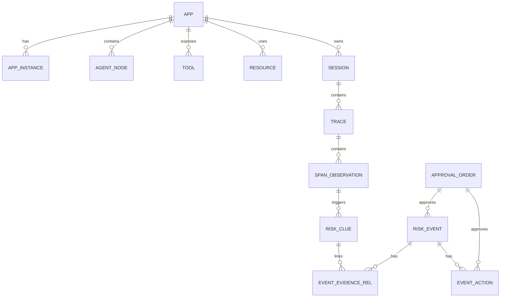
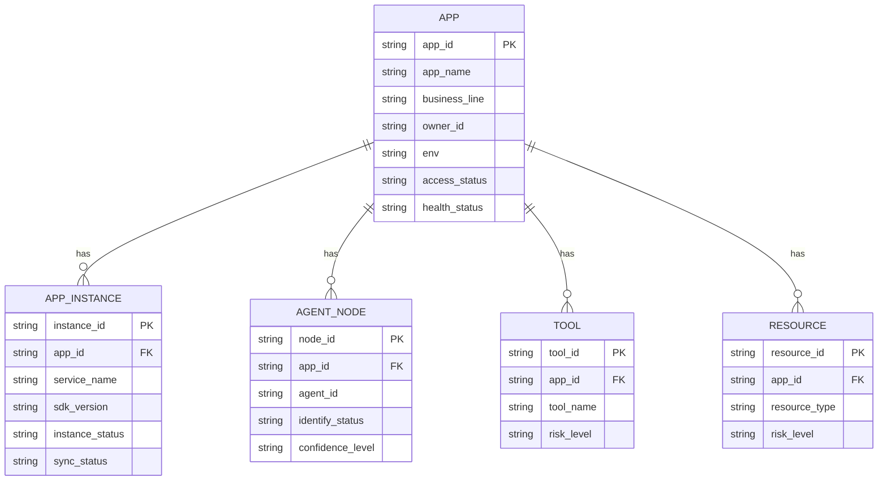
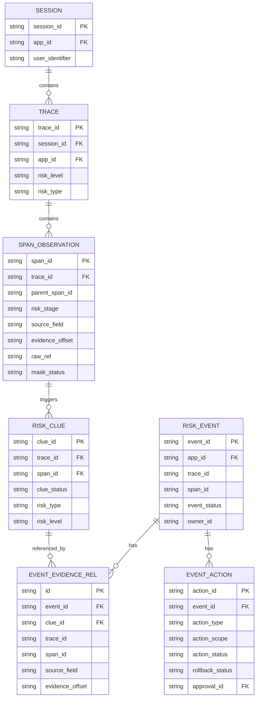
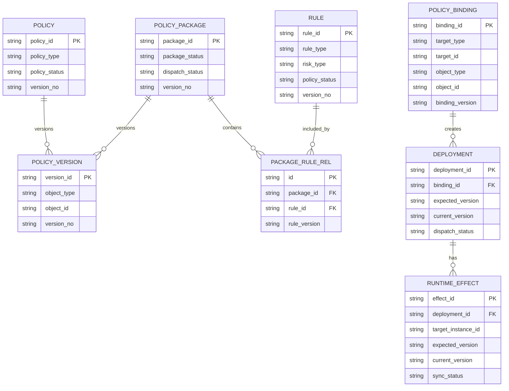
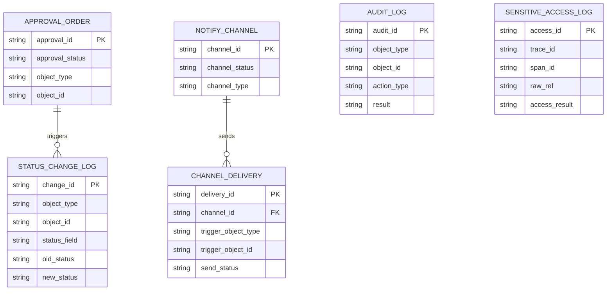

# 逻辑 ER 图

## 1. 文档目标

本文档基于 [47-核心数据模型设计.md](</E:/code/大模型安全监测平台/设计文档/概要设计/完整版/47-核心数据模型设计.md>) 和 [48-核心字段字典.md](</E:/code/大模型安全监测平台/设计文档/概要设计/完整版/48-核心字段字典.md>)，给出平台核心对象的逻辑关系图。

本文档用于概要设计评审、接口 DTO 拆分和后续数据库详细设计，不替代物理表结构设计。

---

## 2. 总体对象关系

说明：

1. 应用是资产、会话、Trace 和风险事件的主归属对象。
2. Span 是最小证据锚点。
3. 风险线索是事件创建前的识别结果。
4. 正式事件通过 `event_evidence_rel` 关联一个或多个证据。
5. 审批单可关联事件或处置动作。

---

## 3. 资产域 ER

---

## 4. 证据与事件域 ER

---

## 5. 策略治理域 ER

---

## 6. 审批、通知与审计域 ER

---

## 7. 设计约束

1. 事件主表只保存主证据锚点，多证据关系通过 `event_evidence_rel` 表达。
2. 策略发布和回滚必须通过 `deployment` 表达，不直接覆盖当前版本。
3. 实例级生效状态必须通过 `runtime_effect` 表达。
4. Raw 证据只通过 `raw_ref` 引用，不进入事件主表或通知正文。
5. 所有核心状态变更必须写入 `status_change_log`。

---

## 8. 后续详细设计重点

1. 主键生成规则。
2. 外键是否物理约束。
3. 明细表和宽表拆分。
4. 事件、Trace、Span 的分区与索引。
5. 审计日志和高敏访问日志的保留周期。
