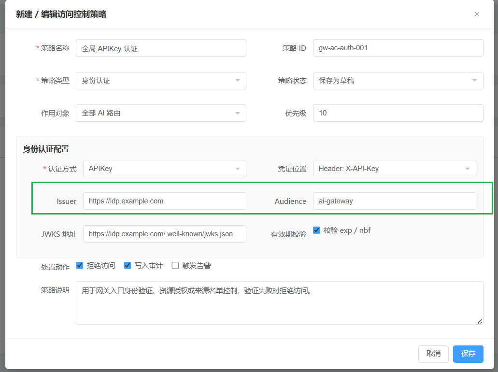
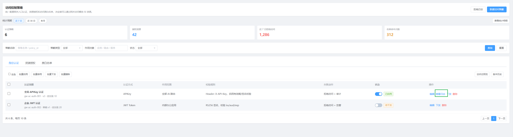
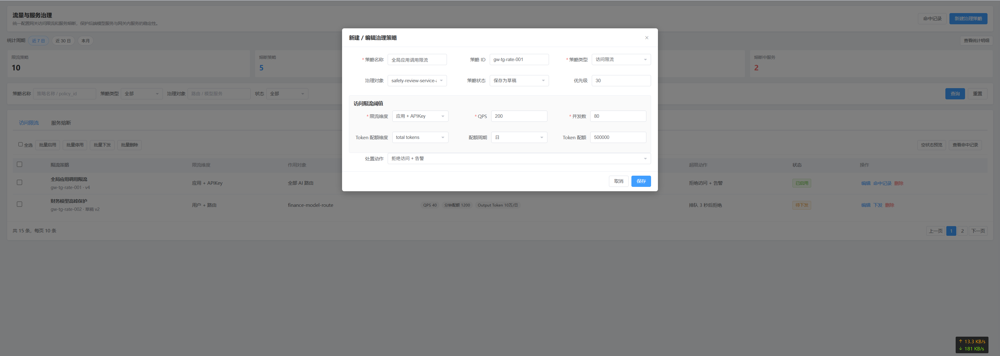
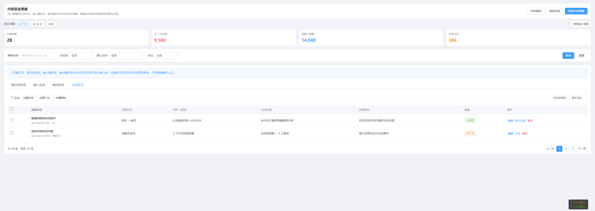

1、访问控制策略中的Issuer和Audience分别是做什么的？最起码要改为中文，方便用户理解

另外考虑下不同的认证方式下面，下面的各项是不是也要做出同步调整。

2、访问控制策略列表中操作列去掉访问日志选项

3、流量与服务治理列表页面去掉操作列中的命中记录选项

在编辑或者新建治理策略页面中如果治理对象不同，是不是要同步的修改相关的内容，这里的治理对象应该是治理对象分类吧。

在策略类型是服务熔断的时候，恢复条件支持自然语言的描述？？？？

4、内容安全策略页面中会话安全和输入安全、输出安全有什么区别？我理解会话安全应该是两个的合集，或者其它考虑？

5、会话审计页面主要是查看日志，不要和事件关联，另外不要体现风险评分，只是做简单的会话查询。或者风险评分应该如何获取？

6、绑定与下发功能页面中有版本的概念，但是没有看到手工设定版本管理的相关页面
